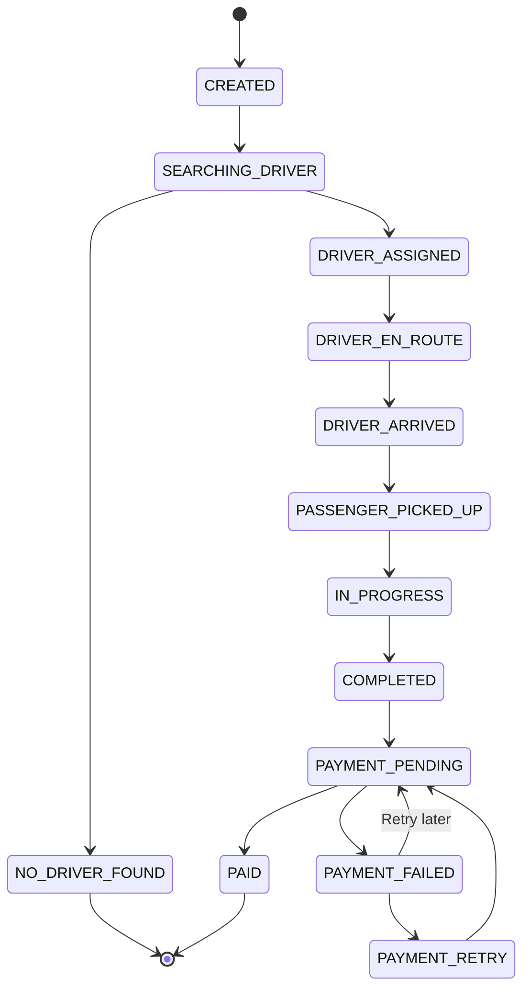
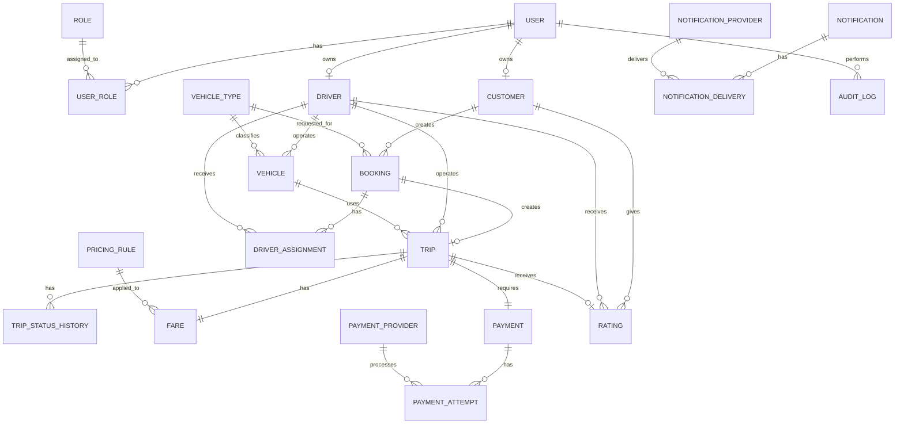
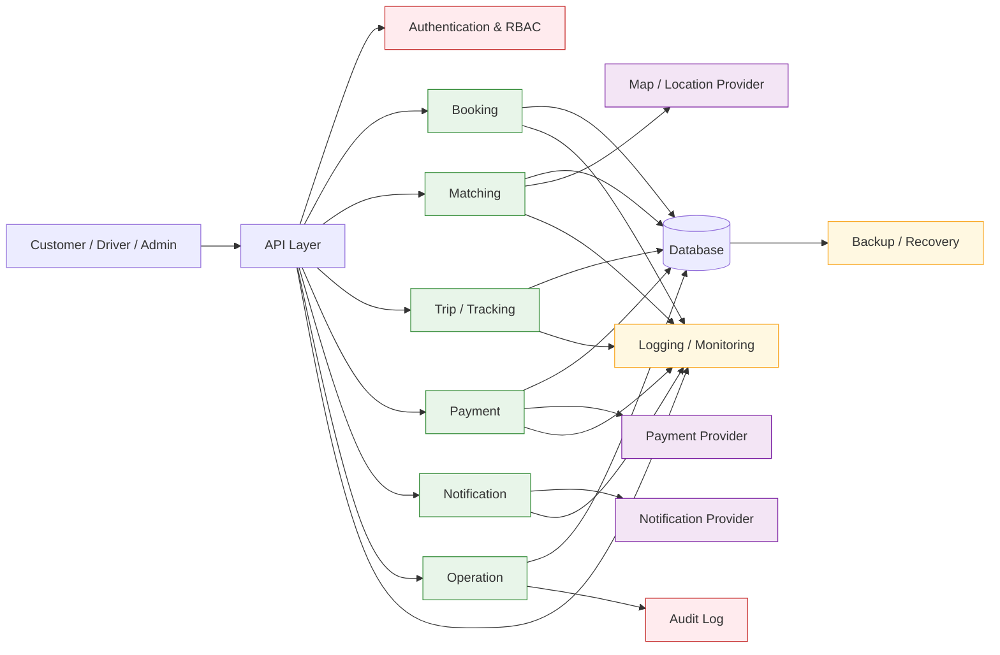
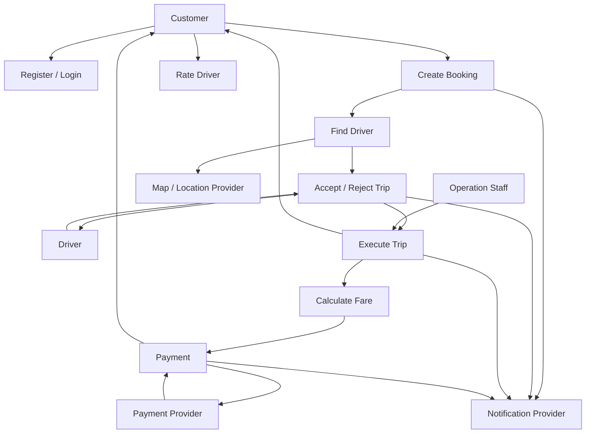
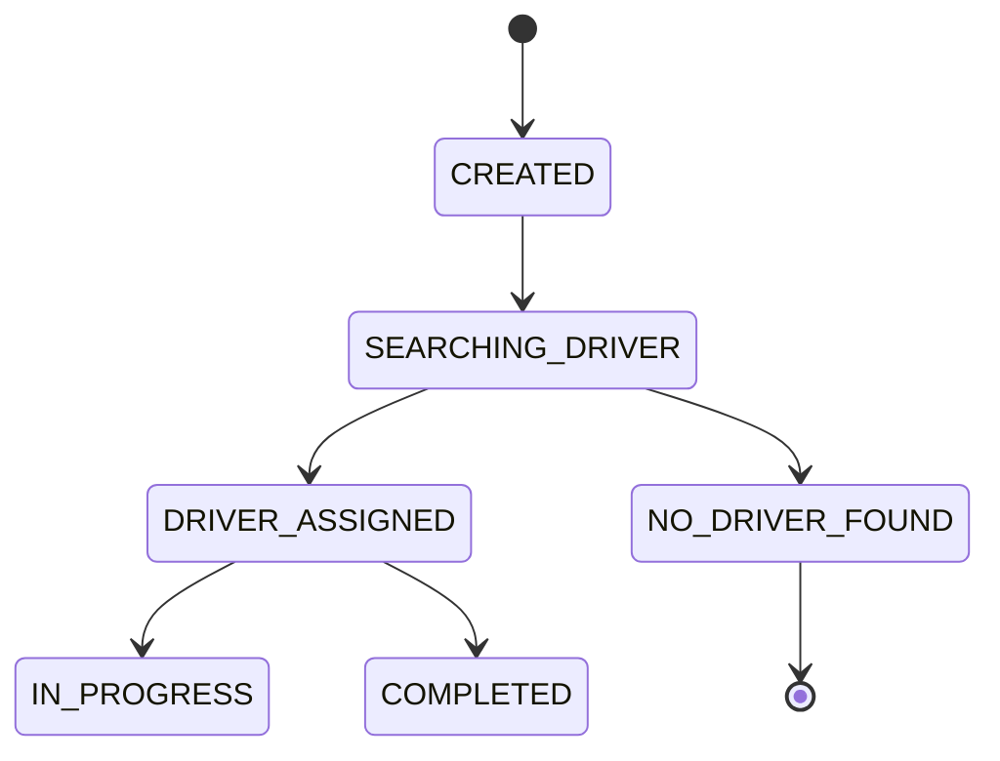
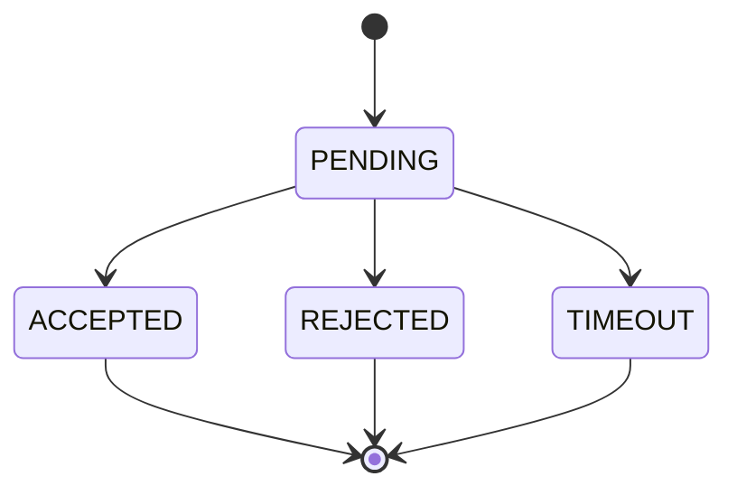
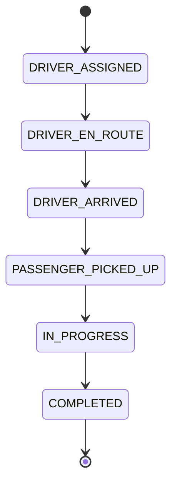
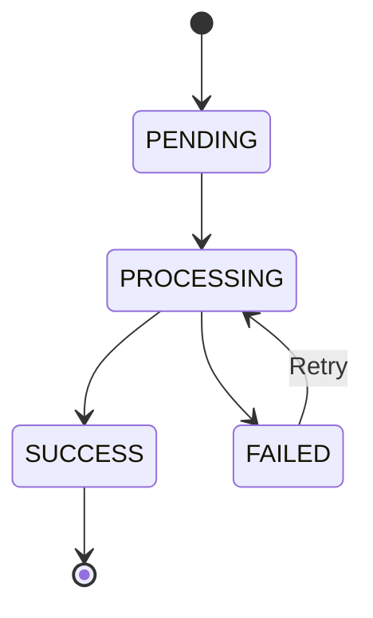
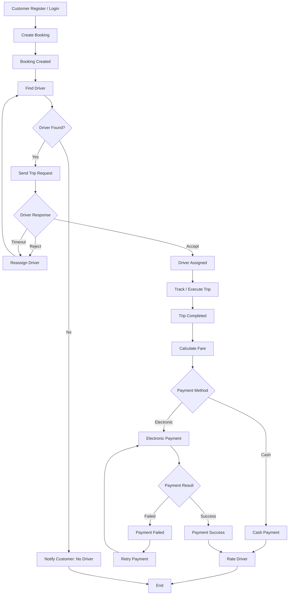

# SRS — CAB System (Nền tảng đặt xe)

---

## Bước 1 — Business Context & Business Problem 

### 1. Business Context

- ABC đang chuyển đổi từ mô hình đặt xe phụ thuộc vào tổng đài và phân công tài xế thủ công sang mô hình nền tảng CAB số hóa và tự động hóa. CAB đóng vai trò là hệ thống trung tâm kết nối khách hàng, tài xế và bộ phận vận hành, quản lý toàn bộ vòng đời chuyến xe từ đặt xe, tìm tài xế, thực hiện chuyến, tính cước, thanh toán, thông báo đến đánh giá. Hệ thống đồng thời tích hợp với các hệ thống bên ngoài như Payment Provider, Notification Provider và Map/Location Provider.

- Về mặt kinh doanh, CAB cần giúp ABC giảm thao tác thủ công, nâng cao tỷ lệ đáp ứng chuyến, cải thiện trải nghiệm khách hàng, tăng hiệu quả vận hành và tạo nền tảng có khả năng mở rộng cho các loại dịch vụ, phương thức thanh toán và kênh thông báo mới.

- Trong phạm vi hiện tại, các quy tắc về pricing, driver matching, timeout, cancellation, payment retry, location tracking và data retention chưa được chốt và cần được xác nhận trước khi hoàn thiện thiết kế chi tiết.

### 2. Business Problem

- ABC hiện đang gặp khó khăn trong việc vận hành và mở rộng dịch vụ đặt xe do quy trình booking và phân công tài xế còn phụ thuộc nhiều vào thao tác thủ công, trong khi khả năng theo dõi chuyến, quản lý thanh toán, thông báo và hỗ trợ vận hành chưa được tập trung trên một nền tảng thống nhất.

- Những hạn chế này làm tăng thời gian xử lý yêu cầu, tăng tải cho bộ phận vận hành, làm giảm khả năng cung cấp thông tin realtime cho khách hàng và gây khó khăn trong việc xử lý các trường hợp ngoại lệ. Đồng thời, kiến trúc hiện tại chưa đáp ứng tốt yêu cầu mở rộng số lượng khách hàng, tài xế và chuyến đi, cũng như việc bổ sung các loại dịch vụ, phương thức thanh toán và kênh thông báo mới.

- Do đó, ABC cần một nền tảng CAB có khả năng số hóa và tự động hóa toàn bộ vòng đời chuyến xe, đồng thời cung cấp khả năng quản lý tập trung, realtime visibility, integration với các hệ thống bên ngoài và kiến trúc đủ linh hoạt để đáp ứng nhu cầu phát triển dài hạn.

---

## Bước 2 — Stakeholder 

### 3. Stakeholder

**1. Business Stakeholders**
- Ban Giám đốc / Sponsor
- Finance / Accounting

**2. Operational Stakeholders**
- Operation Staff
- Customer Support
- Admin

**3. End Users**
- Customer
- Driver

**4. Technology Stakeholders**
- IT / Technical Team
- Security / Compliance

**5. External Stakeholders**
- Payment Provider
- Notification Provider
- Map / Location Provider
- Other External Service Providers

**Matrix Stakeholder tổng quan:**

# Power–Interest Matrix

| Nhóm Stakeholder | Power | Interest | Quadrant | Cách quản lý |
|---|---|---|---|---|
| Ban Giám đốc / Sponsor | Cao | Cao | **Manage closely** | Quản lý chặt chẽ |
| Operation Staff | Cao | Cao | **Manage closely** | Quản lý chặt chẽ |
| IT / Technical Team | Cao | Cao | **Manage closely** | Quản lý chặt chẽ |
| Security / Compliance | Cao | Cao | **Manage closely** | Quản lý chặt chẽ |
| Finance / Accounting | Cao | Thấp | **Keep satisfied** | Duy trì hài lòng |
| Admin | Thấp | Thấp | **Monitor** | Theo dõi |
| Customer | Thấp | Cao | **Keep informed** | Cập nhật thông tin |
| Driver | Thấp | Cao | **Keep informed** | Cập nhật thông tin |
| Customer Support | Thấp | Cao | **Keep informed** | Cập nhật thông tin |
| Payment Provider | Thấp | Thấp | **Monitor** | Theo dõi |
| Notification Provider | Thấp | Thấp | **Monitor** | Theo dõi |
| Map/Location Provider | Thấp | Thấp | **Monitor** | Theo dõi |
| Other External Providers | Thấp | Thấp | **Monitor** | Theo dõi |

## Ma trận

| | **Interest thấp** | **Interest cao** |
|---|---|---|
| **Power cao** | 🟡 **Keep satisfied**<br>- Finance / Accounting | 🔴 **Manage closely**<br>- Ban Giám đốc / Sponsor<br>- Operation Staff<br>- IT / Technical Team<br>- Security / Compliance |
| **Power thấp** | 🟢 **Monitor**<br>- Admin<br>- Payment Provider<br>- Notification Provider<br>- Map/Location Provider<br>- Other External Providers | 🔵 **Keep informed**<br>- Customer<br>- Driver<br>- Customer Support |

### Chiến lược
- 🔴 **Manage closely:** Phối hợp thường xuyên, tham vấn và cập nhật liên tục.
- 🟡 **Keep satisfied:** Đảm bảo nhu cầu được đáp ứng, tránh để phát sinh vấn đề.
- 🔵 **Keep informed:** Cung cấp thông tin và cập nhật tiến độ phù hợp.
- 🟢 **Monitor:** Theo dõi ở mức cần thiết, không cần giao tiếp thường xuyên.

---

## Bước 3 — Business Goal 

### 4. Business Goal

| Mã | Business Goal | Mô tả |
|---|---|---|
| BG1 | Số hóa và tự động hóa vòng đời chuyến xe | Chuyển đổi toàn bộ quy trình đặt xe, tìm tài xế và phân công từ thao tác thủ công qua tổng đài sang quy trình tự động trên nền tảng số, giảm sự phụ thuộc vào con người trong các bước có thể tự động hóa (matching, thông báo, tính cước). |
| BG2 | Nâng cao tỷ lệ đáp ứng chuyến (fulfillment rate) | Tăng tỷ lệ chuyến được tìm thấy tài xế thành công và hoàn thành, thông qua cơ chế matching thông minh và xử lý timeout/reassign khi tài xế không phản hồi hoặc từ chối, hạn chế tình trạng khách hàng không tìm được xe. |
| BG3 | Cải thiện trải nghiệm khách hàng và tài xế | Cung cấp khả năng theo dõi realtime trạng thái chuyến đi (tìm tài xế, tài xế nhận chuyến, thời gian dự kiến đến, hoàn thành chuyến), lịch sử chuyến, thanh toán minh bạch và đánh giá sau chuyến, giúp tăng mức độ hài lòng và giữ chân người dùng. |
| BG4 | Tập trung hóa quản lý vận hành và dữ liệu | Xây dựng giao diện quản trị tập trung cho nhân viên vận hành để giám sát chuyến, tài xế, xử lý ngoại lệ và tra cứu lịch sử giao dịch, thay vì thông tin phân tán như hiện tại; đồng thời cung cấp báo cáo về số lượng chuyến, doanh thu, tỷ lệ hoàn thành/hủy và hiệu quả tài xế phục vụ ra quyết định. |
| BG5 | Đảm bảo khả năng mở rộng (scalability) và tính sẵn sàng cao (high availability) | Thiết kế kiến trúc cho phép các thành phần hệ thống (booking, payment, notification, tracking) mở rộng độc lập khi tải tăng, và đảm bảo lỗi ở một phân hệ (ví dụ payment hoặc notification) không làm gián đoạn toàn bộ hệ thống đặt xe. |
| BG6 | Tạo nền tảng linh hoạt cho phát triển dài hạn | Cho phép bổ sung trong tương lai các loại hình dịch vụ mới, phương thức thanh toán mới, nhà cung cấp thông báo mới hoặc thay đổi thành phần kỹ thuật mà không cần xây dựng lại toàn bộ hệ thống, thông qua kiến trúc tích hợp (Payment Provider, Notification Provider, Map/Location Provider) theo hướng module hóa. |
| BG7 | Đảm bảo an toàn và tuân thủ dữ liệu | Bảo vệ thông tin cá nhân, dữ liệu vị trí, dữ liệu giao dịch và thông tin thanh toán; kiểm soát quyền truy cập theo vai trò (role-based access) đối với các thao tác quản trị nhạy cảm; lưu vết (audit log) các thao tác quan trọng phục vụ điều tra sự cố. |

---

## Bước 4 — Project Scope 

### 5. Project Scope

#### 5.1 In-Scope (MVP)

**A. Customer**
- Đăng ký / đăng nhập tài khoản
- Cập nhật thông tin cá nhân cơ bản
- Nhập điểm đón, điểm đến, chọn loại xe
- Gửi yêu cầu đặt xe
- Theo dõi trạng thái chuyến (đang tìm tài xế / đã có tài xế / đang di chuyển / hoàn thành)
- Xem lịch sử chuyến và số tiền đã thanh toán
- Đánh giá tài xế sau chuyến (rating đơn giản)

**B. Driver**
- Đăng ký / được Operation tạo tài khoản
- Cập nhật hồ sơ, thông tin phương tiện
- Chuyển trạng thái sẵn sàng / không sẵn sàng nhận chuyến
- Nhận thông báo chuyến mới, chấp nhận / từ chối
- Cập nhật trạng thái chuyến: đã đến điểm đón, đã đón khách, đang di chuyển, hoàn thành

**C. Driver Matching**
- Tìm tài xế phù hợp dựa trên vị trí và trạng thái sẵn sàng (thuật toán matching cơ bản — chưa cần tối ưu nâng cao)
- Cơ chế timeout + reassign sang tài xế khác nếu không phản hồi/từ chối
- Thông báo cho khách hàng nếu không tìm được tài xế

**D. Pricing & Payment**
- Tính cước cơ bản dựa trên loại dịch vụ + thông tin chuyến (công thức đơn giản, chưa gồm surge/dynamic pricing)
- Thanh toán tiền mặt
- Tích hợp 1 Payment Provider cho thanh toán điện tử (không lưu thông tin thẻ trong hệ thống CAB)
- Thông báo khi giao dịch thất bại + cho phép retry cơ bản

**E. Notification**
- Thông báo cho khách hàng: yêu cầu được tiếp nhận, tài xế nhận chuyến, tài xế đến, hoàn thành chuyến, kết quả thanh toán
- Thông báo cho tài xế: chuyến mới, thay đổi chuyến đang thực hiện
- Tích hợp 1 kênh thông báo (ví dụ push notification hoặc SMS) — kiến trúc cho phép mở rộng thêm kênh sau

**F. Operation/Admin**
- Giao diện quản trị cơ bản: xem chuyến đang diễn ra, trạng thái tài xế
- Hỗ trợ xử lý chuyến lỗi (thủ công)
- Tra cứu lịch sử giao dịch
- Phân quyền cơ bản (Admin vs Operation Staff)

**G. Non-functional (mức tối thiểu cho MVP)**
- Xác thực người dùng (Customer, Driver, Admin)
- Kiểm soát truy cập cho thao tác quản trị nhạy cảm
- Log các thao tác quan trọng (audit log cơ bản)
- Kiến trúc cho phép các module (payment, notification) lỗi độc lập không kéo sập toàn hệ thống

#### 5.2 Out-of-Scope

- Báo cáo nâng cao (doanh thu, tỷ lệ hủy, hiệu quả tài xế theo thời gian, dashboard BI)
- Đa dạng phương thức thanh toán (ví điện tử, thẻ tín dụng lưu sẵn, thanh toán trả sau)
- Nhiều kênh thông báo đồng thời (email + SMS + push + in-app)
- Thuật toán matching nâng cao (machine learning, dự đoán nhu cầu, surge pricing)
- Đa loại hình dịch vụ (giao hàng, xe ghép, đặt trước theo lịch)
- Ứng dụng riêng cho Driver/Customer (MVP có thể dùng web responsive hoặc app tối giản)
- Tối ưu hóa location tracking nâng cao (dự đoán ETA chính xác cao, bản đồ realtime chi tiết)
- Chính sách hủy chuyến phức tạp, phí phạt hủy
- Tích hợp nhiều Payment/Notification/Map Provider song song (chỉ 1 provider mỗi loại cho MVP)

---

## Bước 5 — Business Requirement 

### 6. Business Requirement

> **Business Requirement** mô tả cái hệ thống cần làm được ở mức nghiệp vụ (chưa đi sâu vào chi tiết chức năng/màn hình như Functional Requirement), gắn với từng Business Goal và nằm trong phạm vi MVP đã chốt.

| Mã | Business Requirement | Liên kết Business Goal | Nhóm |
|---|---|---|---|
| BR-01 | Hệ thống phải cho phép khách hàng tự đăng ký, xác thực và tạo yêu cầu đặt xe mà không cần qua tổng đài | BG1, BG2 | Booking |
| BR-02 | Hệ thống phải tự động tìm và phân công tài xế phù hợp dựa trên vị trí và trạng thái sẵn sàng, không cần thao tác thủ công của Operation | BG1, BG2 | Matching |
| BR-03 | Hệ thống phải xử lý được trường hợp tài xế không phản hồi/từ chối bằng cách tự động chuyển sang tài xế khác, không yêu cầu khách hàng tạo lại yêu cầu | BG2 | Matching |
| BR-04 | Hệ thống phải cung cấp cho khách hàng khả năng theo dõi trạng thái chuyến đi theo thời gian thực | BG3 | Tracking |
| BR-05 | Hệ thống phải tự động tính cước dựa trên loại dịch vụ và thông tin chuyến sau khi hoàn thành | BG1, BG2 | Payment |
| BR-06 | Hệ thống phải hỗ trợ thanh toán tiền mặt và tích hợp với một nhà cung cấp thanh toán điện tử bên ngoài | BG3, BG6 | Payment |
| BR-07 | Hệ thống không được lưu trữ trực tiếp thông tin nhạy cảm về thẻ/tài khoản thanh toán của khách hàng | BG7 | Payment / Security |
| BR-08 | Hệ thống phải gửi thông báo tới khách hàng và tài xế tại các mốc quan trọng của chuyến đi (tiếp nhận, tài xế nhận chuyến, đến điểm đón, hoàn thành, kết quả thanh toán) | BG3 | Notification |
| BR-09 | Hệ thống phải cung cấp giao diện quản trị để Operation Staff giám sát chuyến đang diễn ra và xử lý các trường hợp ngoại lệ | BG4 | Operation |
| BR-10 | Hệ thống phải phân quyền truy cập, đảm bảo nhân viên thông thường không thể thực hiện các thao tác quản trị nhạy cảm | BG7 | Security |
| BR-11 | Hệ thống phải ghi log các thao tác quan trọng phục vụ tra soát khi có sự cố | BG7 | Security / Audit |
| BR-12 | Kiến trúc hệ thống phải cho phép các thành phần (booking, payment, notification) hoạt động và mở rộng độc lập, lỗi một thành phần không được làm gián đoạn toàn hệ thống | BG5 | Architecture |
| BR-13 | Kiến trúc hệ thống phải cho phép bổ sung provider mới (thanh toán, thông báo, bản đồ) trong tương lai mà không cần xây dựng lại toàn bộ hệ thống | BG6 | Architecture |

## Bước 6 - Business Process

## Bước 7 - Functional Requirement


## 6. Functional Requirement

### 6.1 Authentication & Account Management

| Mã     | Functional Requirement                                                                               | Actor                   | Priority |
| ------ | ---------------------------------------------------------------------------------------------------- | ----------------------- | -------- |
| FR-001 | Hệ thống phải cho phép Customer đăng ký tài khoản bằng thông tin định danh được cấu hình cho MVP.    | Customer                | Must     |
| FR-002 | Hệ thống phải cho phép người dùng đăng nhập bằng thông tin xác thực hợp lệ.                          | Customer, Driver, Admin | Must     |
| FR-003 | Hệ thống phải xác thực thông tin đăng nhập trước khi cấp quyền truy cập các chức năng tương ứng.     | System                  | Must     |
| FR-004 | Hệ thống phải cho phép Customer cập nhật thông tin cá nhân cơ bản.                                   | Customer                | Must     |
| FR-005 | Hệ thống phải cho phép Driver cập nhật hồ sơ và thông tin phương tiện theo quyền được cấp.           | Driver, Operation       | Must     |
| FR-006 | Hệ thống phải phân biệt vai trò Customer, Driver, Operation Staff và Admin khi người dùng đăng nhập. | System                  | Must     |
| FR-007 | Hệ thống phải từ chối truy cập chức năng nếu người dùng không có quyền tương ứng.                    | System                  | Must     |

---

### 6.2 Customer & Booking

| Mã     | Functional Requirement                                                                     | Actor    | Priority |
| ------ | ------------------------------------------------------------------------------------------ | -------- | -------- |
| FR-008 | Hệ thống phải cho phép Customer nhập điểm đón và điểm đến.                                 | Customer | Must     |
| FR-009 | Hệ thống phải cho phép Customer lựa chọn loại xe/dịch vụ được hỗ trợ.                      | Customer | Must     |
| FR-010 | Hệ thống phải nhận yêu cầu đặt xe và tạo booking tương ứng.                                | Customer | Must     |
| FR-011 | Hệ thống phải kiểm tra các thông tin bắt buộc trước khi tạo booking.                       | System   | Must     |
| FR-012 | Hệ thống phải tạo mã định danh duy nhất cho mỗi booking/chuyến xe.                         | System   | Must     |
| FR-013 | Hệ thống phải ghi nhận thời gian tạo booking, Customer, điểm đón, điểm đến và loại xe.     | System   | Must     |
| FR-014 | Hệ thống phải xác nhận cho Customer rằng yêu cầu đặt xe đã được tiếp nhận.                 | System   | Must     |
| FR-015 | Hệ thống phải hiển thị trạng thái hiện tại của booking cho Customer.                       | Customer | Must     |
| FR-016 | Hệ thống phải ngăn Customer tạo các booking không hợp lệ theo business rule được cấu hình. | System   | Must     |

---

### 6.3 Driver Matching

| Mã     | Functional Requirement                                                                                                                           | Actor  | Priority |
| ------ | ------------------------------------------------------------------------------------------------------------------------------------------------ | ------ | -------- |
| FR-017 | Hệ thống phải xác định các Driver đang ở trạng thái sẵn sàng nhận chuyến.                                                                        | System | Must     |
| FR-018 | Hệ thống phải sử dụng vị trí hiện tại của Driver để xác định Driver phù hợp với booking.                                                         | System | Must     |
| FR-019 | Hệ thống phải gửi yêu cầu nhận chuyến tới Driver phù hợp.                                                                                        | System | Must     |
| FR-020 | Hệ thống phải ghi nhận phản hồi của Driver đối với yêu cầu nhận chuyến.                                                                          | System | Must     |
| FR-021 | Hệ thống phải xác định yêu cầu nhận chuyến đã timeout nếu Driver không phản hồi trong khoảng thời gian được cấu hình.                            | System | Must     |
| FR-022 | Khi Driver từ chối hoặc timeout, hệ thống phải thực hiện matching lại với Driver khác.                                                           | System | Must     |
| FR-023 | Hệ thống không được gửi cùng một booking tới Driver đã từ chối booking đó trong cùng vòng matching, trừ khi có business rule khác được cấu hình. | System | Must     |
| FR-024 | Hệ thống phải xác nhận Driver đầu tiên đáp ứng hợp lệ cho booking theo cơ chế locking/concurrency phù hợp.                                       | System | Must     |
| FR-025 | Hệ thống phải cập nhật booking sang trạng thái đã có Driver khi matching thành công.                                                             | System | Must     |
| FR-026 | Nếu không còn Driver phù hợp, hệ thống phải cập nhật booking sang trạng thái không tìm được Driver.                                              | System | Must     |
| FR-027 | Hệ thống phải thông báo cho Customer khi không tìm được Driver.                                                                                  | System | Must     |

> **Open point:** giá trị timeout, bán kính tìm Driver và tiêu chí “phù hợp” chưa được chốt trong Business Requirement và cần được xác nhận.

---

### 6.4 Trip Management & Tracking

| Mã     | Functional Requirement                                                                            | Actor    | Priority |
| ------ | ------------------------------------------------------------------------------------------------- | -------- | -------- |
| FR-028 | Hệ thống phải quản lý trạng thái vòng đời của chuyến xe.                                          | System   | Must     |
| FR-029 | Hệ thống phải cho phép Driver cập nhật trạng thái “Đã đến điểm đón”.                              | Driver   | Must     |
| FR-030 | Hệ thống phải cho phép Driver cập nhật trạng thái “Đã đón khách”.                                 | Driver   | Must     |
| FR-031 | Hệ thống phải cho phép Driver cập nhật trạng thái “Đang di chuyển”.                               | Driver   | Must     |
| FR-032 | Hệ thống phải cho phép Driver cập nhật trạng thái “Hoàn thành”.                                   | Driver   | Must     |
| FR-033 | Hệ thống phải kiểm tra tính hợp lệ của chuyển đổi trạng thái trước khi cập nhật.                  | System   | Must     |
| FR-034 | Hệ thống phải cập nhật trạng thái chuyến cho Customer khi trạng thái thay đổi.                    | System   | Must     |
| FR-035 | Hệ thống phải cung cấp cho Customer khả năng theo dõi trạng thái chuyến gần realtime.             | Customer | Must     |
| FR-036 | Hệ thống phải sử dụng Map/Location Provider để hỗ trợ thông tin vị trí phục vụ matching/tracking. | System   | Must     |
| FR-037 | Hệ thống phải ghi nhận các sự kiện trạng thái quan trọng của chuyến để phục vụ tra cứu.           | System   | Must     |

---

### 6.5 Pricing

| Mã     | Functional Requirement                                                     | Actor  | Priority |
| ------ | -------------------------------------------------------------------------- | ------ | -------- |
| FR-038 | Hệ thống phải xác định mức cước dựa trên loại dịch vụ và thông tin chuyến. | System | Must     |
| FR-039 | Hệ thống phải tính cước cuối chuyến khi Driver hoàn thành chuyến.          | System | Must     |
| FR-040 | Hệ thống phải lưu lại số tiền cước cuối cùng của chuyến.                   | System | Must     |
| FR-041 | Hệ thống phải cung cấp số tiền cần thanh toán cho Customer.                | System | Must     |
| FR-042 | Hệ thống không được áp dụng surge/dynamic pricing trong MVP.               | System | Must     |

> **Open point:** công thức pricing cụ thể chưa được chốt, do đó FR-038 cần được bổ sung rule chi tiết sau khi Business xác nhận.

---

### 6.6 Payment

| Mã     | Functional Requirement                                                                                      | Actor    | Priority |
| ------ | ----------------------------------------------------------------------------------------------------------- | -------- | -------- |
| FR-043 | Hệ thống phải cho phép Customer lựa chọn thanh toán tiền mặt hoặc thanh toán điện tử.                       | Customer | Must     |
| FR-044 | Đối với thanh toán điện tử, hệ thống phải gửi yêu cầu thanh toán tới Payment Provider.                      | System   | Must     |
| FR-045 | Hệ thống phải nhận và xử lý kết quả giao dịch từ Payment Provider.                                          | System   | Must     |
| FR-046 | Hệ thống phải cập nhật trạng thái giao dịch thành công khi Payment Provider xác nhận thanh toán thành công. | System   | Must     |
| FR-047 | Hệ thống phải ghi nhận giao dịch thất bại khi Payment Provider trả về kết quả thất bại.                     | System   | Must     |
| FR-048 | Hệ thống phải thông báo cho Customer khi thanh toán điện tử thất bại.                                       | System   | Must     |
| FR-049 | Hệ thống phải cho phép Customer thực hiện retry thanh toán theo cơ chế được cấu hình.                       | Customer | Must     |
| FR-050 | Hệ thống phải đảm bảo việc retry không tạo ra giao dịch thanh toán trùng cho cùng một nghĩa vụ thanh toán.  | System   | Must     |
| FR-051 | Hệ thống không được lưu trực tiếp thông tin thẻ hoặc thông tin thanh toán nhạy cảm của Customer.            | System   | Must     |
| FR-052 | Hệ thống phải lưu thông tin tham chiếu giao dịch cần thiết để tra cứu và đối soát.                          | System   | Must     |
| FR-053 | Hệ thống phải hiển thị lịch sử thanh toán của Customer.                                                     | Customer | Must     |

---

### 6.7 Notification

| Mã     | Functional Requirement                                                                             | Actor  | Priority |
| ------ | -------------------------------------------------------------------------------------------------- | ------ | -------- |
| FR-054 | Hệ thống phải gửi thông báo khi booking được tiếp nhận.                                            | System | Must     |
| FR-055 | Hệ thống phải gửi thông báo khi Driver nhận chuyến.                                                | System | Must     |
| FR-056 | Hệ thống phải gửi thông báo khi Driver đến điểm đón.                                               | System | Must     |
| FR-057 | Hệ thống phải gửi thông báo khi chuyến hoàn thành.                                                 | System | Must     |
| FR-058 | Hệ thống phải gửi thông báo kết quả thanh toán cho Customer.                                       | System | Must     |
| FR-059 | Hệ thống phải gửi thông báo chuyến mới cho Driver phù hợp.                                         | System | Must     |
| FR-060 | Hệ thống phải ghi nhận trạng thái gửi thông báo để phục vụ monitoring và troubleshooting.          | System | Should   |
| FR-061 | Hệ thống phải tách logic nghiệp vụ khỏi Notification Provider thông qua một abstraction/interface. | System | Must     |
| FR-062 | Hệ thống phải cho phép thay thế hoặc bổ sung Notification Provider trong tương lai.                | System | Should   |

---

### 6.8 Driver Management

| Mã     | Functional Requirement                                                                            | Actor     | Priority |
| ------ | ------------------------------------------------------------------------------------------------- | --------- | -------- |
| FR-063 | Hệ thống phải cho phép Driver chuyển trạng thái sẵn sàng nhận chuyến.                             | Driver    | Must     |
| FR-064 | Hệ thống phải cho phép Driver chuyển trạng thái không sẵn sàng nhận chuyến.                       | Driver    | Must     |
| FR-065 | Hệ thống chỉ được đưa Driver đang sẵn sàng vào danh sách matching.                                | System    | Must     |
| FR-066 | Hệ thống phải lưu trạng thái hiện tại của Driver.                                                 | System    | Must     |
| FR-067 | Hệ thống phải hiển thị danh sách và trạng thái Driver cho Operation Staff.                        | Operation | Must     |
| FR-068 | Hệ thống phải cập nhật trạng thái Driver phù hợp sau khi Driver nhận/thực hiện/hoàn thành chuyến. | System    | Must     |

---

### 6.9 Operation & Admin

| Mã     | Functional Requirement                                                                             | Actor     | Priority |
| ------ | -------------------------------------------------------------------------------------------------- | --------- | -------- |
| FR-069 | Hệ thống phải cung cấp màn hình để Operation Staff xem các chuyến đang diễn ra.                    | Operation | Must     |
| FR-070 | Hệ thống phải hiển thị trạng thái hiện tại của từng chuyến.                                        | Operation | Must     |
| FR-071 | Hệ thống phải hiển thị Driver đang được phân công cho chuyến.                                      | Operation | Must     |
| FR-072 | Hệ thống phải cung cấp khả năng tra cứu lịch sử chuyến.                                            | Operation | Must     |
| FR-073 | Hệ thống phải cung cấp khả năng tra cứu lịch sử giao dịch.                                         | Operation | Must     |
| FR-074 | Hệ thống phải cho phép Operation Staff xử lý các trường hợp chuyến lỗi theo quyền được cấp.        | Operation | Must     |
| FR-075 | Hệ thống phải yêu cầu xác nhận trước các thao tác quản trị có khả năng thay đổi trạng thái chuyến. | System    | Should   |
| FR-076 | Hệ thống phải phân biệt quyền của Admin và Operation Staff.                                        | System    | Must     |
| FR-077 | Hệ thống phải hạn chế các thao tác quản trị nhạy cảm đối với Operation Staff không có quyền.       | System    | Must     |

---

### 6.10 Rating

| Mã     | Functional Requirement                                                     | Actor    | Priority |
| ------ | -------------------------------------------------------------------------- | -------- | -------- |
| FR-078 | Hệ thống phải cho phép Customer đánh giá Driver sau khi chuyến hoàn thành. | Customer | Must     |
| FR-079 | Hệ thống phải cho phép Customer gửi rating theo thang điểm được cấu hình.  | Customer | Must     |
| FR-080 | Hệ thống phải lưu rating gắn với chuyến và Driver tương ứng.               | System   | Must     |
| FR-081 | Hệ thống không được cho phép Customer đánh giá cùng một chuyến nhiều lần.  | System   | Must     |

---

### 6.11 History & Audit

| Mã     | Functional Requirement                                                                                  | Actor    | Priority |
| ------ | ------------------------------------------------------------------------------------------------------- | -------- | -------- |
| FR-082 | Hệ thống phải lưu lịch sử chuyến của Customer.                                                          | System   | Must     |
| FR-083 | Hệ thống phải cho phép Customer xem lịch sử chuyến của chính mình.                                      | Customer | Must     |
| FR-084 | Hệ thống phải lưu các sự kiện quan trọng trong vòng đời chuyến.                                         | System   | Must     |
| FR-085 | Hệ thống phải ghi audit log đối với các thao tác quản trị quan trọng.                                   | System   | Must     |
| FR-086 | Audit log phải chứa tối thiểu thông tin người thực hiện, thời gian, hành động và đối tượng bị tác động. | System   | Must     |
| FR-087 | Hệ thống phải hạn chế quyền truy cập audit log theo role/permission.                                    | System   | Must     |

---

## 6.12 Business Status Model

Để các Functional Requirement không bị mâu thuẫn với nhau, nên chuẩn hóa lifecycle của Booking/Trip:



### 6.13 Traceability giữa BR và FR

| Business Requirement | Functional Requirements                                          |
| -------------------- | ---------------------------------------------------------------- |
| BR-01                | FR-001 → FR-016                                                  |
| BR-02                | FR-017 → FR-020, FR-024 → FR-026                                 |
| BR-03                | FR-021 → FR-023                                                  |
| BR-04                | FR-028 → FR-037                                                  |
| BR-05                | FR-038 → FR-042                                                  |
| BR-06                | FR-043 → FR-049                                                  |
| BR-07                | FR-050 → FR-052                                                  |
| BR-08                | FR-054 → FR-062                                                  |
| BR-09                | FR-069 → FR-075                                                  |
| BR-10                | FR-006, FR-007, FR-076, FR-077                                   |
| BR-11                | FR-084 → FR-087                                                  |
| BR-12                | FR-061, FR-062 và các yêu cầu kiến trúc/NFR liên quan            |
| BR-13                | FR-061, FR-062 và abstraction tương ứng cho Payment/Map Provider |

### Một số điểm cần Business chốt trước khi khóa FR

1. **Authentication:** đăng ký bằng email, phone hay phương thức nào?
2. **Matching:** bán kính tìm Driver, thứ tự ưu tiên và số vòng reassign.
3. **Timeout:** Driver có bao nhiêu giây để accept/reject?
4. **Cancellation:** MVP đang out-of-scope policy phức tạp, nhưng có cần basic cancellation không?
5. **Pricing:** công thức tính cước chính xác.
6. **Payment:** retry tối đa bao nhiêu lần và trạng thái cuối nếu thất bại.
7. **Tracking:** tần suất cập nhật location và mức độ realtime.
8. **Notification:** MVP chọn Push hay SMS.
9. **Data retention:** thời gian lưu trip, payment và audit log.
10. **Admin override:** Operation được phép thay đổi những trạng thái nào và cần approval hay không.

**Khuyến nghị:** phần FR trên nên được xem là **baseline v1**, chưa nên đánh số lại/xóa các FR khi Business chưa trả lời các open points. Sau khi chốt, chúng ta có thể chuyển tiếp sang **Use Case Specification + User Story + Acceptance Criteria**, đồng thời tạo **FR → Use Case traceability matrix** để hoàn thiện SRS.

## Bước 7
Dựa trên context CAB hiện tại, phần **Business Rules & Business Exceptions** nên tách khỏi Functional Requirement. Business Rule trả lời **“nghiệp vụ phải tuân theo nguyên tắc nào?”**, còn Business Exception trả lời **“nếu tình huống bất thường xảy ra thì nghiệp vụ xử lý thế nào?”**.

## 7. Business Rules & Business Exceptions

### 7.1 Business Rules — Nguyên tắc nghiệp vụ

#### 7.1.1 Account & Access Rules

| Mã      | Business Rule      | Mô tả                                                                                         |
| ------- | ------------------ | --------------------------------------------------------------------------------------------- |
| BRL-001 | Unique Account     | Mỗi tài khoản người dùng phải được định danh duy nhất trong hệ thống.                         |
| BRL-002 | Role-based Access  | Người dùng chỉ được thực hiện các chức năng phù hợp với role được cấp.                        |
| BRL-003 | Active Account     | Chỉ tài khoản đang ở trạng thái hoạt động mới được sử dụng các chức năng nghiệp vụ tương ứng. |
| BRL-004 | Driver Eligibility | Chỉ Driver đủ điều kiện theo trạng thái hồ sơ/hoạt động mới được tham gia matching.           |
| BRL-005 | Admin Privilege    | Các thao tác quản trị nhạy cảm chỉ được thực hiện bởi role có quyền tương ứng.                |

---

#### 7.1.2 Booking Rules

| Mã      | Business Rule       | Mô tả                                                                                                                                    |
| ------- | ------------------- | ---------------------------------------------------------------------------------------------------------------------------------------- |
| BRL-006 | Valid Booking       | Booking chỉ được tạo khi đầy đủ thông tin bắt buộc: Customer, điểm đón, điểm đến và loại xe.                                             |
| BRL-007 | Unique Booking      | Mỗi booking phải có một mã định danh duy nhất.                                                                                           |
| BRL-008 | Booking Ownership   | Customer chỉ được xem thông tin các booking thuộc tài khoản của mình.                                                                    |
| BRL-009 | Booking Lifecycle   | Booking phải tuân thủ lifecycle trạng thái được định nghĩa của CAB.                                                                      |
| BRL-010 | One Active Booking  | Một Customer không được tạo nhiều booking đang hoạt động nếu business chưa cho phép.                                                     |
| BRL-011 | Immutable Trip Data | Sau khi Driver đã nhận chuyến, các thông tin quan trọng như điểm đón/điểm đến không được tự ý thay đổi nếu chưa có business rule hỗ trợ. |

---

#### 7.1.3 Driver Matching Rules

| Mã      | Business Rule           | Mô tả                                                                                                             |
| ------- | ----------------------- | ----------------------------------------------------------------------------------------------------------------- |
| BRL-012 | Available Driver        | Chỉ Driver đang ở trạng thái sẵn sàng nhận chuyến mới được đưa vào matching.                                      |
| BRL-013 | Location-based Matching | Matching phải dựa trên vị trí hiện tại của Driver và thông tin vị trí của booking.                                |
| BRL-014 | Driver Eligibility      | Driver phải phù hợp với loại xe/dịch vụ mà Customer yêu cầu.                                                      |
| BRL-015 | No Duplicate Assignment | Một Driver không được đồng thời nhận nhiều chuyến vượt quá khả năng phục vụ được cấu hình.                        |
| BRL-016 | First Valid Acceptance  | Booking chỉ được xác nhận cho một Driver hợp lệ đầu tiên đáp ứng yêu cầu.                                         |
| BRL-017 | Reassignment            | Driver từ chối hoặc không phản hồi trong thời gian quy định thì booking phải được đưa trở lại quá trình matching. |
| BRL-018 | Exclude Rejected Driver | Driver đã từ chối booking không được tiếp tục nhận lại booking đó trong cùng vòng matching.                       |
| BRL-019 | Matching Exhaustion     | Khi không còn Driver phù hợp, booking phải chuyển sang trạng thái không tìm được Driver.                          |

> **Cần xác nhận:** bán kính matching, tiêu chí ưu tiên Driver, timeout và số lần reassign chưa được chốt.

---

#### 7.1.4 Trip Execution Rules

| Mã      | Business Rule                 | Mô tả                                                                                                               |
| ------- | ----------------------------- | ------------------------------------------------------------------------------------------------------------------- |
| BRL-020 | Valid Status Transition       | Chuyến chỉ được chuyển sang trạng thái tiếp theo nếu trạng thái hiện tại cho phép chuyển đổi.                       |
| BRL-021 | Driver-controlled Trip Status | Driver là actor chính cập nhật các trạng thái thực tế của chuyến trong quá trình thực hiện.                         |
| BRL-022 | Sequential Trip Lifecycle     | Chuyến phải đi theo trình tự nghiệp vụ hợp lệ: Assigned → En Route → Arrived → Picked Up → In Progress → Completed. |
| BRL-023 | Completion Authority          | Chỉ Driver hoặc actor có quyền tương ứng mới được xác nhận chuyến hoàn thành.                                       |
| BRL-024 | Completed Trip Immutability   | Sau khi chuyến hoàn thành, không được tự ý thay đổi các thông tin nghiệp vụ quan trọng nếu không có quyền override. |

---

#### 7.1.5 Pricing Rules

| Mã      | Business Rule             | Mô tả                                                                                   |
| ------- | ------------------------- | --------------------------------------------------------------------------------------- |
| BRL-025 | Configured Pricing        | Cước phải được tính theo công thức pricing được Business phê duyệt.                     |
| BRL-026 | Service-based Pricing     | Giá cước phải phụ thuộc tối thiểu vào loại dịch vụ/loại xe và thông tin chuyến.         |
| BRL-027 | Final Fare                | Cước cuối cùng được xác định khi chuyến hoàn thành.                                     |
| BRL-028 | No Dynamic Pricing in MVP | MVP không áp dụng surge/dynamic pricing.                                                |
| BRL-029 | Fare Traceability         | Hệ thống phải lưu được thông tin cần thiết để giải thích/tra soát số tiền cước đã tính. |

---

#### 7.1.6 Payment Rules

| Mã      | Business Rule                | Mô tả                                                                                                 |
| ------- | ---------------------------- | ----------------------------------------------------------------------------------------------------- |
| BRL-030 | Supported Payment Methods    | MVP hỗ trợ tiền mặt và một phương thức thanh toán điện tử thông qua Payment Provider.                 |
| BRL-031 | No Sensitive Payment Storage | CAB không được lưu trực tiếp thông tin thẻ/tài khoản thanh toán nhạy cảm.                             |
| BRL-032 | Payment Reference            | Mỗi giao dịch điện tử phải có thông tin tham chiếu để đối soát.                                       |
| BRL-033 | Payment Idempotency          | Một nghĩa vụ thanh toán không được tạo ra nhiều giao dịch thành công do retry hoặc duplicate request. |
| BRL-034 | Successful Payment           | Chỉ giao dịch được Payment Provider xác nhận thành công mới được ghi nhận là thanh toán thành công.   |
| BRL-035 | Failed Payment               | Giao dịch thất bại phải được ghi nhận và thông báo cho Customer.                                      |
| BRL-036 | Payment Retry                | Customer có thể retry thanh toán theo chính sách retry được cấu hình.                                 |
| BRL-037 | Cash Payment                 | Thanh toán tiền mặt phải được ghi nhận theo cơ chế nghiệp vụ được ABC phê duyệt.                      |

> **Cần xác nhận:** số lần retry tối đa, thời gian retry và trạng thái của chuyến khi payment thất bại.

---

#### 7.1.7 Notification Rules

| Mã      | Business Rule                  | Mô tả                                                                                            |
| ------- | ------------------------------ | ------------------------------------------------------------------------------------------------ |
| BRL-038 | Event-based Notification       | Notification được kích hoạt dựa trên các business event quan trọng.                              |
| BRL-039 | Customer Notification          | Customer phải nhận thông báo tại các milestone được quy định.                                    |
| BRL-040 | Driver Notification            | Driver phải nhận thông báo khi có booking phù hợp hoặc thay đổi quan trọng liên quan đến chuyến. |
| BRL-041 | Provider Abstraction           | Business logic không được phụ thuộc trực tiếp vào một Notification Provider cụ thể.              |
| BRL-042 | Notification Failure Isolation | Notification thất bại không được làm thất bại transaction nghiệp vụ chính.                       |

---

#### 7.1.8 Operation Rules

| Mã      | Business Rule                | Mô tả                                                                              |
| ------- | ---------------------------- | ---------------------------------------------------------------------------------- |
| BRL-043 | Operational Visibility       | Operation Staff phải có khả năng xem các chuyến đang diễn ra và trạng thái Driver. |
| BRL-044 | Exception Handling           | Operation được phép xử lý các trường hợp ngoại lệ trong phạm vi quyền được cấp.    |
| BRL-045 | Controlled Override          | Các thao tác override trạng thái phải được giới hạn theo role/permission.          |
| BRL-046 | Auditability                 | Các thao tác override hoặc xử lý exception quan trọng phải được audit log.         |
| BRL-047 | No Unauthorized Modification | Operation không được thay đổi dữ liệu ngoài phạm vi quyền hạn.                     |

---

#### 7.1.9 Rating Rules

| Mã      | Business Rule       | Mô tả                                                                 |
| ------- | ------------------- | --------------------------------------------------------------------- |
| BRL-048 | Completed Trip Only | Customer chỉ được đánh giá sau khi chuyến đã hoàn thành.              |
| BRL-049 | One Rating per Trip | Một Customer chỉ được đánh giá một lần cho một chuyến.                |
| BRL-050 | Trip Ownership      | Chỉ Customer thực hiện chuyến mới được đánh giá Driver của chuyến đó. |
| BRL-051 | Rating Association  | Rating phải được liên kết với đúng Trip và Driver.                    |

---

#### 7.1.10 Audit & Data Rules

| Mã      | Business Rule           | Mô tả                                                               |
| ------- | ----------------------- | ------------------------------------------------------------------- |
| BRL-052 | Audit Critical Actions  | Các thao tác quan trọng phải được ghi audit log.                    |
| BRL-053 | Audit Actor             | Audit log phải xác định được ai thực hiện thao tác.                 |
| BRL-054 | Audit Timestamp         | Audit log phải lưu thời điểm thực hiện thao tác.                    |
| BRL-055 | Audit Target            | Audit log phải xác định đối tượng/dữ liệu bị tác động.              |
| BRL-056 | Access-controlled Audit | Chỉ role được cấp quyền mới được xem audit log.                     |
| BRL-057 | Data Retention          | Dữ liệu phải được lưu theo chính sách retention được ABC phê duyệt. |

> **Open point:** thời gian retention cho trip, location, payment và audit log chưa được chốt.

---

# 7.2 Business Exceptions — Ngoại lệ nghiệp vụ

| Mã     | Exception                               | Điều kiện                                              | Business Handling                                                                                         |
| ------ | --------------------------------------- | ------------------------------------------------------ | --------------------------------------------------------------------------------------------------------- |
| BE-001 | Không tìm được Driver                   | Không có Driver phù hợp                                | Booking chuyển sang `NO_DRIVER_FOUND`, thông báo Customer.                                                |
| BE-002 | Driver không phản hồi                   | Driver không phản hồi trong timeout                    | Booking quay lại matching và tìm Driver khác.                                                             |
| BE-003 | Driver từ chối                          | Driver chủ động reject                                 | Loại Driver khỏi vòng matching hiện tại và tìm Driver khác.                                               |
| BE-004 | Hết Driver khả dụng                     | Tất cả Driver phù hợp đều reject/timeout               | Kết thúc matching và thông báo Customer không tìm được xe.                                                |
| BE-005 | Driver mất kết nối                      | Driver mất kết nối trong quá trình xử lý booking       | CAB phải xác định trạng thái booking và xử lý theo cơ chế timeout/reassign phù hợp.                       |
| BE-006 | Location không khả dụng                 | Không lấy được vị trí Driver                           | Không sử dụng Driver đó cho matching nếu không đáp ứng điều kiện location.                                |
| BE-007 | Map Provider lỗi                        | Map/Location Provider không phản hồi                   | Không được làm sập toàn bộ CAB; hệ thống phải ghi nhận lỗi và xử lý theo fallback/retry được cấu hình.    |
| BE-008 | Booking duplicate                       | Customer gửi cùng request nhiều lần                    | Hệ thống phải ngăn việc tạo nhiều booking ngoài ý muốn.                                                   |
| BE-009 | Concurrent Driver Acceptance            | Nhiều Driver cùng accept một booking gần như đồng thời | Chỉ một Driver được xác nhận; các request còn lại phải bị từ chối/đánh dấu không còn hiệu lực.            |
| BE-010 | Payment Provider timeout                | Payment Provider không phản hồi                        | Giao dịch không được tự động kết luận là thành công; phải giữ trạng thái phù hợp để retry/reconciliation. |
| BE-011 | Payment failed                          | Provider trả về thất bại                               | Ghi nhận failed, thông báo Customer và cho phép retry theo policy.                                        |
| BE-012 | Payment duplicate callback              | Provider gửi callback nhiều lần                        | Hệ thống phải xử lý idempotent, không tạo nhiều payment thành công.                                       |
| BE-013 | Payment callback chậm                   | Callback đến sau thời điểm request timeout             | Hệ thống phải xử lý callback nếu giao dịch vẫn hợp lệ.                                                    |
| BE-014 | Notification Provider lỗi               | Không gửi được notification                            | Ghi nhận lỗi; không rollback business transaction chính.                                                  |
| BE-015 | Customer mất kết nối                    | Customer mất mạng trong lúc booking/tracking           | Booking/trip vẫn tiếp tục theo trạng thái server; Customer có thể xem lại trạng thái khi kết nối lại.     |
| BE-016 | Driver mất kết nối khi đang chạy        | Driver không gửi được update                           | Không tự động kết luận chuyến thất bại; Operation có thể kiểm tra và xử lý exception.                     |
| BE-017 | Invalid status transition               | Actor gửi yêu cầu chuyển trạng thái không hợp lệ       | Từ chối thao tác và giữ nguyên trạng thái hiện tại.                                                       |
| BE-018 | Unauthorized operation                  | User thực hiện chức năng không thuộc quyền             | Từ chối request và ghi log phù hợp.                                                                       |
| BE-019 | Trip completion conflict                | Có nhiều request hoàn thành cùng một chuyến            | Chỉ một request hợp lệ được ghi nhận; request duplicate phải idempotent.                                  |
| BE-020 | Pricing calculation error               | Không thể tính cước                                    | Không xác nhận payment amount; chuyển exception để xử lý.                                                 |
| BE-021 | Payment pending sau khi Trip hoàn thành | Chuyến hoàn thành nhưng payment chưa hoàn tất          | Trip và Payment phải được quản lý như các trạng thái độc lập; không làm mất dữ liệu chuyến.               |
| BE-022 | Operation cần can thiệp                 | Chuyến ở trạng thái bất thường không thể tự động xử lý | Operation xử lý thủ công theo quyền được cấp và phải có audit log.                                        |
| BE-023 | Rating duplicate                        | Customer gửi rating nhiều lần                          | Chỉ rating hợp lệ đầu tiên được ghi nhận.                                                                 |
| BE-024 | Rating cho trip không thuộc Customer    | Customer cố đánh giá trip của người khác               | Từ chối thao tác.                                                                                         |
| BE-025 | Service unavailable                     | Một external provider tạm thời không hoạt động         | CAB phải cô lập lỗi provider và duy trì các chức năng không phụ thuộc provider đó nếu có thể.             |

---

# 7.3 Exception Handling Principles

Các ngoại lệ trên nên tuân theo một số nguyên tắc chung:

### EP-01 — Không làm mất trạng thái nghiệp vụ

Khi xảy ra lỗi integration hoặc lỗi tạm thời, hệ thống phải ưu tiên **bảo toàn trạng thái và dữ liệu nghiệp vụ** thay vì rollback toàn bộ workflow nếu không cần thiết.

### EP-02 — External Failure Isolation

Lỗi của:

* Payment Provider
* Notification Provider
* Map/Location Provider

không được làm CAB ngừng hoạt động hoàn toàn.

Điều này trực tiếp hỗ trợ **BG5 / BR-12**.

### EP-03 — Idempotency

Các operation có khả năng được gửi lại nhiều lần phải đảm bảo không tạo ra kết quả nghiệp vụ trùng lặp, đặc biệt:

* Booking creation
* Driver acceptance
* Trip completion
* Payment
* Payment callback
* Notification event

### EP-04 — State Consistency

Mọi thay đổi trạng thái phải được kiểm tra dựa trên trạng thái hiện tại của entity.

Ví dụ:

```text
DRIVER_ASSIGNED
      ↓
DRIVER_EN_ROUTE
      ↓
DRIVER_ARRIVED
      ↓
PASSENGER_PICKED_UP
      ↓
IN_PROGRESS
      ↓
COMPLETED
```

Không được phép chuyển trực tiếp:

```text
DRIVER_ASSIGNED → COMPLETED
```

nếu business chưa định nghĩa cơ chế override.

### EP-05 — Manual Intervention

Khi hệ thống không thể tự xử lý exception, case phải được đưa tới **Operation Staff** thay vì để dữ liệu rơi vào trạng thái không xác định.

### EP-06 — Auditability

Các thao tác xử lý exception bằng tay phải có audit log tối thiểu:

```text
Who       → Ai thực hiện
When      → Thời điểm
What      → Thao tác gì
Target    → Đối tượng nào
Reason    → Lý do xử lý
Result    → Kết quả
```

---

# 7.4 Business Rule Priority

Để thuận tiện cho việc quản lý requirement, có thể phân loại:

| Priority   | Ý nghĩa                                     |
| ---------- | ------------------------------------------- |
| **Must**   | Bắt buộc cho MVP                            |
| **Should** | Nên có trong MVP nhưng có thể defer nếu cần |
| **Future** | Không thuộc MVP, định hướng cho phase sau   |

Các rule liên quan đến **matching timeout, cancellation, pricing formula, payment retry limit, location tracking frequency và data retention** hiện nên đánh dấu **TBD / Business Confirmation Required**, vì context ban đầu xác định đây là các quy tắc chưa được chốt.

### Traceability

```text
BG1 ──┬── BR-01 ── Booking Rules
      ├── BR-02 ── Matching Rules
      └── BR-05 ── Pricing Rules

BG2 ──┬── BR-02 ── Matching Rules
      ├── BR-03 ── Reassignment / Timeout
      └── BR-05 ── Pricing Rules

BG3 ──┬── BR-04 ── Trip / Tracking Rules
      ├── BR-06 ── Payment Rules
      └── BR-08 ── Notification Rules

BG4 ──┬── BR-09 ── Operation Rules
      └── BR-11 ── Audit Rules

BG5 ──┬── BR-12 ── Exception / Failure Isolation
      └── External Provider Failure Rules

BG6 ──┬── BR-06 ── Payment Provider
      ├── BR-08 ── Notification Provider
      └── BR-13 ── Provider Abstraction

BG7 ──┬── BR-07 ── Payment Security
      ├── BR-10 ── Access Control
      └── BR-11 ── Audit / Data Rules
```

**Lưu ý quan trọng:** phần này nên được đặt **sau Functional Requirement** trong SRS. Khi đi tiếp sang **Use Case**, các `BRL-*` và `BE-*` sẽ trở thành nguồn để xây dựng **Pre-condition, Business Rules, Alternate Flow và Exception Flow** của từng Use Case.

## Bước 9 - Business Entity
xác định các Business Entity cho ERD


## 8. Xác định các thực thể ERD

### 8.1 Core Entities

| Entity          | Mô tả                                             | Vai trò                           |
| --------------- | ------------------------------------------------- | --------------------------------- |
| **User**        | Tài khoản đăng nhập và thông tin định danh cơ bản | Quản lý Customer, Driver, Staff   |
| **Role**        | Vai trò hệ thống                                  | Phân quyền                        |
| **UserRole**    | Quan hệ User–Role                                 | Một User có thể có một/nhiều Role |
| **Customer**    | Thông tin nghiệp vụ riêng của khách hàng          | Đặt xe                            |
| **Driver**      | Thông tin nghiệp vụ riêng của tài xế              | Nhận và thực hiện chuyến          |
| **Vehicle**     | Thông tin phương tiện của Driver                  | Phục vụ matching                  |
| **VehicleType** | Loại xe/dịch vụ                                   | Pricing + Matching                |

> `User` nên là entity dùng chung cho authentication/authorization, trong khi `Customer`, `Driver` là profile nghiệp vụ. Cách này giúp tránh việc Customer/Driver phải tự quản lý credential riêng.

---

## 8.2 Booking & Trip Entities

| Entity                | Mô tả                                                             |
| --------------------- | ----------------------------------------------------------------- |
| **Booking**           | Yêu cầu đặt xe do Customer tạo                                    |
| **Trip**              | Chuyến xe được thực hiện sau khi Booking được matching thành công |
| **TripStatusHistory** | Lịch sử thay đổi trạng thái của Trip                              |
| **DriverAssignment**  | Lịch sử/record phân công Driver cho Booking/Trip                  |

### Quan hệ chính

```text
Customer
   │
   │ 1:N
   ▼
Booking
   │
   │ 1:1 / 1:0..1
   ▼
Trip
   │
   ├──────── 1:N ────────> TripStatusHistory
   │
   └──────── 1:N ────────> DriverAssignment
                              │
                              ▼
                            Driver
```

### Tại sao cần `DriverAssignment`?

Không nên chỉ lưu:

```text
Booking.driver_id
```

vì CAB có nghiệp vụ:

```text
Driver A → Timeout
Driver B → Reject
Driver C → Accept
```

Do đó cần lưu được lịch sử matching/reassignment.

Ví dụ:

| Assignment | Booking | Driver | Status   |
| ---------- | ------- | ------ | -------- |
| DA001      | BK001   | D001   | TIMEOUT  |
| DA002      | BK001   | D002   | REJECTED |
| DA003      | BK001   | D003   | ACCEPTED |

Điều này rất quan trọng cho **BR-03** và việc audit/debug matching.

---

# 8.3 Location Entities

| Entity               | Mô tả                                             |
| -------------------- | ------------------------------------------------- |
| **Location**         | Địa điểm đón/trả hoặc tọa độ liên quan đến chuyến |
| **DriverLocation**   | Vị trí hiện tại/lịch sử của Driver                |
| **LocationProvider** | Thông tin provider Map/Location                   |

Tuy nhiên, đối với MVP tôi khuyến nghị **không over-design**.

Có thể bắt đầu với:

```text
Booking
 ├── pickup_location
 └── dropoff_location
```

và Driver có:

```text
Driver
 ├── current_latitude
 └── current_longitude
```

Nếu sau này cần tracking chi tiết:

```text
DriverLocation
----------------
id
driver_id
latitude
longitude
recorded_at
```

sẽ được bổ sung.

---

# 8.4 Pricing & Payment Entities

### Pricing

| Entity          | Mô tả                          |
| --------------- | ------------------------------ |
| **PricingRule** | Rule/cấu hình tính giá         |
| **Fare**        | Kết quả tính cước của một Trip |

### Payment

| Entity              | Mô tả                                  |
| ------------------- | -------------------------------------- |
| **Payment**         | Nghĩa vụ/giao dịch thanh toán của Trip |
| **PaymentAttempt**  | Một lần attempt thanh toán             |
| **PaymentProvider** | Provider thanh toán bên ngoài          |

Quan hệ:

```text
Trip
 │
 │ 1:1
 ▼
Fare
 │
 │
 │ 1:1
 ▼
Payment
 │
 │ 1:N
 ▼
PaymentAttempt
 │
 ▼
PaymentProvider
```

### Tại sao cần `PaymentAttempt`?

Vì business requirement có:

> Payment thất bại → Customer có thể retry.

Ví dụ:

```text
Payment
PAY001
Amount = 150,000
Status = PAID

        │
        ├── Attempt 1 → FAILED
        ├── Attempt 2 → FAILED
        └── Attempt 3 → SUCCESS
```

Nếu chỉ có một bảng `Payment`, chúng ta sẽ mất lịch sử attempt.

---

# 8.5 Notification Entities

| Entity                   | Mô tả                               |
| ------------------------ | ----------------------------------- |
| **Notification**         | Business notification/event cần gửi |
| **NotificationDelivery** | Kết quả gửi notification            |
| **NotificationProvider** | Provider/kênh notification          |

Quan hệ:

```text
Notification
      │
      │ 1:N
      ▼
NotificationDelivery
      │
      ▼
NotificationProvider
```

Ví dụ:

```text
Notification
"Driver đã nhận chuyến"

       │
       ▼
NotificationDelivery
       │
       ├── SENT
       └── Provider = Push Provider
```

Cấu trúc này phù hợp với:

**BR-08 + BG6**

vì sau này có thể thay đổi provider mà không thay đổi business entity chính.

---

# 8.6 Rating

| Entity     | Mô tả                                          |
| ---------- | ---------------------------------------------- |
| **Rating** | Đánh giá của Customer dành cho Driver sau Trip |

Quan hệ:

```text
Customer 1 ───── N Rating N ───── 1 Driver
                    │
                    │
                    ▼
                   Trip
```

Business rule:

* Một Trip tối đa một Rating.
* Chỉ Customer của Trip mới được Rating.
* Chỉ Trip đã hoàn thành mới được Rating.

---

# 8.7 Operation & Audit

| Entity              | Mô tả                                                    |
| ------------------- | -------------------------------------------------------- |
| **AuditLog**        | Lưu các thao tác quan trọng của User/Staff               |
| **OperationAction** | Có thể dùng nếu cần tách riêng nghiệp vụ xử lý exception |

Ở MVP, tôi khuyến nghị **không tạo `OperationAction` ngay**.

Có thể dùng:

```text
AuditLog
```

để lưu:

```text
actor
action
entity
entity_id
old_value
new_value
reason
created_at
```

Ví dụ:

```text
Operation Staff
      │
      ▼
Change Trip Status
      │
      ▼
AuditLog
      │
      ├── actor = OP001
      ├── action = MANUAL_STATUS_UPDATE
      ├── entity = Trip
      ├── entity_id = TR001
      ├── old_value = DRIVER_EN_ROUTE
      ├── new_value = COMPLETED
      └── reason = Driver mất kết nối
```

---

# 8.8 Entity List đề xuất cho MVP

Nếu gom lại, **ERD Logical Model v1** nên có khoảng **20 entity**:

### Identity & Access

1. `User`
2. `Role`
3. `UserRole`

### Customer / Driver

4. `Customer`
5. `Driver`
6. `Vehicle`
7. `VehicleType`

### Booking / Trip

8. `Booking`
9. `Trip`
10. `DriverAssignment`
11. `TripStatusHistory`

### Pricing / Payment

12. `PricingRule`
13. `Fare`
14. `Payment`
15. `PaymentAttempt`
16. `PaymentProvider`

### Notification

17. `Notification`
18. `NotificationDelivery`
19. `NotificationProvider`

### Feedback / Audit

20. `Rating`
21. `AuditLog`

Tôi đánh giá **21 entity** này là hợp lý cho logical ERD MVP. Không nên thêm quá nhiều entity như `Cancellation`, `SurgePricing`, `Promotion`, `Wallet`, `ScheduledRide`, `RideSharing`... vì chúng đang nằm ngoài scope hoặc chưa có business rule tương ứng.

---

# 8.9 ERD Logical Overview

Có thể biểu diễn quan hệ tổng thể bằng Mermaid như sau:



---

# 8.10 Một điểm cần quyết định: Booking vs Trip

Đây là quyết định quan trọng nhất trước khi đi vào physical ERD.

Tôi khuyến nghị **tách `Booking` và `Trip`**:

```text
Booking
= Customer yêu cầu một chuyến

Trip
= Chuyến thực tế được thực hiện
```

Lifecycle:

```text
Customer
   │
   ▼
Booking
   │
   ├── SEARCHING_DRIVER
   ├── DRIVER_ASSIGNED
   └── NO_DRIVER_FOUND

                │
                │ Matching thành công
                ▼

              Trip
                │
                ├── DRIVER_EN_ROUTE
                ├── DRIVER_ARRIVED
                ├── PASSENGER_PICKED_UP
                ├── IN_PROGRESS
                └── COMPLETED
```

Lợi ích:

* Phân biệt **request** và **actual ride**.
* Dễ xử lý trường hợp booking không tìm được Driver.
* Dễ mở rộng sau này thành scheduled booking, cancelled booking...
* Trip có thể có DriverAssignment history.
* Pricing/Payment/Rating gắn với **Trip**, không phải request ban đầu.

---

# 8.11 Các entity chưa nên đưa vào MVP

Dựa trên Out-of-Scope hiện tại, **chưa cần** đưa vào ERD:

| Entity               | Lý do                          |
| -------------------- | ------------------------------ |
| `Cancellation`       | Cancellation policy chưa chốt  |
| `CancellationFee`    | Phí hủy nằm ngoài MVP          |
| `SurgePricing`       | Dynamic pricing out-of-scope   |
| `Promotion`          | Chưa có business requirement   |
| `Wallet`             | Chưa hỗ trợ wallet             |
| `SavedPaymentMethod` | Không lưu payment information  |
| `ScheduledBooking`   | Đặt xe trước nằm ngoài MVP     |
| `RideSharing`        | Xe ghép out-of-scope           |
| `DeliveryOrder`      | Delivery out-of-scope          |
| `DriverPerformance`  | Báo cáo nâng cao out-of-scope  |
| `DemandForecast`     | ML matching out-of-scope       |
| `EmailTemplate`      | MVP chỉ 1 notification channel |
## Bước 10 - Non-functional Requirement
# 10. Non-functional Requirement


---

## 10.1 Performance

| Mã      | Non-functional Requirement                                                                                                                     | Priority |
| ------- | ---------------------------------------------------------------------------------------------------------------------------------------------- | -------- |
| NFR-001 | Hệ thống phải đáp ứng các request nghiệp vụ thông thường trong thời gian phản hồi phù hợp với SLA được thống nhất.                             | Must     |
| NFR-002 | Đối với các API synchronous thông thường, thời gian phản hồi mục tiêu nên đạt **P95 ≤ 2 giây**, không bao gồm thời gian chờ external provider. | Should   |
| NFR-003 | Hệ thống phải xử lý yêu cầu booking mà không bị phụ thuộc trực tiếp vào thời gian phản hồi của Notification Provider.                          | Must     |
| NFR-004 | Việc gửi notification phải được xử lý theo cơ chế asynchronous khi phù hợp để không làm tăng đáng kể response time của transaction chính.      | Should   |
| NFR-005 | Các thao tác tra cứu lịch sử chuyến và giao dịch phải có thời gian phản hồi phù hợp với SLA vận hành.                                          | Must     |
| NFR-006 | Hệ thống phải hỗ trợ xử lý đồng thời nhiều booking mà không làm sai lệch trạng thái booking hoặc Driver.                                       | Must     |

> **TBD:** số lượng concurrent users, requests/second và booking/second cần được Technical Team xác nhận.

---

## 10.2 Availability

| Mã      | Non-functional Requirement                                                                        | Priority |
| ------- | ------------------------------------------------------------------------------------------------- | -------- |
| NFR-007 | CAB phải có khả năng hoạt động liên tục trong thời gian cung cấp dịch vụ.                         | Must     |
| NFR-008 | Lỗi của một external provider không được làm hệ thống CAB ngừng hoạt động hoàn toàn.              | Must     |
| NFR-009 | Payment Provider không khả dụng không được làm gián đoạn việc theo dõi hoặc quản lý Trip.         | Must     |
| NFR-010 | Notification Provider không khả dụng không được làm thất bại Booking hoặc Trip transaction.       | Must     |
| NFR-011 | Hệ thống phải có cơ chế retry hoặc recovery phù hợp cho các integration có khả năng lỗi tạm thời. | Should   |
| NFR-012 | Hệ thống phải có cơ chế health check để phát hiện service/component không hoạt động.              | Must     |

> **TBD:** Availability target như `99.9%` cần được Business/Technical Team xác nhận trước khi đưa thành SLA chính thức.

---

## 10.3 Scalability

| Mã      | Non-functional Requirement                                                                                                    | Priority |
| ------- | ----------------------------------------------------------------------------------------------------------------------------- | -------- |
| NFR-013 | Kiến trúc phải cho phép các module có tải cao được scale độc lập.                                                             | Must     |
| NFR-014 | Booking, Matching, Payment, Notification và Tracking không được thiết kế theo cách bắt buộc scale toàn bộ hệ thống cùng nhau. | Must     |
| NFR-015 | Hệ thống phải hỗ trợ tăng số lượng Customer, Driver và Trip mà không yêu cầu thay đổi lớn kiến trúc tổng thể.                 | Must     |
| NFR-016 | Các thành phần xử lý asynchronous phải có khả năng scale theo queue/message workload.                                         | Should   |
| NFR-017 | Việc bổ sung instance của service không được tạo ra duplicate processing đối với các transaction nghiệp vụ quan trọng.        | Must     |

---

## 10.4 Reliability & Fault Tolerance

| Mã      | Non-functional Requirement                                                                                        | Priority |
| ------- | ----------------------------------------------------------------------------------------------------------------- | -------- |
| NFR-018 | Hệ thống phải đảm bảo lỗi của một component không làm mất dữ liệu nghiệp vụ đã được ghi nhận thành công.          | Must     |
| NFR-019 | Các operation có khả năng được retry phải đảm bảo **idempotency**.                                                | Must     |
| NFR-020 | Payment callback phải được xử lý idempotent để tránh ghi nhận thanh toán nhiều lần.                               | Must     |
| NFR-021 | Driver acceptance phải được xử lý concurrency-safe để một booking không được xác nhận đồng thời cho nhiều Driver. | Must     |
| NFR-022 | Hệ thống phải có cơ chế xử lý message/event thất bại mà không làm mất event quan trọng.                           | Should   |
| NFR-023 | Hệ thống phải có cơ chế recovery sau khi service hoặc integration bị gián đoạn.                                   | Should   |
| NFR-024 | Hệ thống phải đảm bảo transaction consistency đối với các thay đổi trạng thái quan trọng.                         | Must     |

---

# 10.5 Security

Security là nhóm NFR quan trọng vì **BG7** yêu cầu bảo vệ PII, location, transaction và payment data.

| Mã      | Non-functional Requirement                                                                   | Priority |
| ------- | -------------------------------------------------------------------------------------------- | -------- |
| NFR-025 | Tất cả chức năng yêu cầu authentication phải xác thực người dùng trước khi xử lý.            | Must     |
| NFR-026 | Hệ thống phải áp dụng **Role-Based Access Control (RBAC)**.                                  | Must     |
| NFR-027 | User chỉ được truy cập dữ liệu thuộc phạm vi quyền của mình.                                 | Must     |
| NFR-028 | Customer không được truy cập dữ liệu Customer khác.                                          | Must     |
| NFR-029 | Driver không được truy cập dữ liệu không thuộc phạm vi chuyến của mình.                      | Must     |
| NFR-030 | Operation Staff và Admin phải có quyền khác nhau đối với các chức năng quản trị nhạy cảm.    | Must     |
| NFR-031 | Communication giữa client và backend phải được bảo vệ bằng cơ chế encryption phù hợp.        | Must     |
| NFR-032 | Sensitive data phải được bảo vệ khi lưu trữ và truyền tải theo chính sách security của ABC.  | Must     |
| NFR-033 | CAB không được lưu trực tiếp thông tin thẻ/payment credential nhạy cảm.                      | Must     |
| NFR-034 | Credential/password không được lưu dưới dạng plaintext.                                      | Must     |
| NFR-035 | API phải kiểm tra authorization tại server-side và không được chỉ dựa vào kiểm soát trên UI. | Must     |
| NFR-036 | Các thao tác quản trị nhạy cảm phải được audit.                                              | Must     |
| NFR-037 | Hệ thống phải có cơ chế bảo vệ API khỏi các request không hợp lệ hoặc abuse cơ bản.          | Should   |

---

# 10.6 Privacy & Data Protection

| Mã      | Non-functional Requirement                                                                       | Priority |
| ------- | ------------------------------------------------------------------------------------------------ | -------- |
| NFR-038 | Hệ thống phải hạn chế việc thu thập dữ liệu cá nhân ở mức cần thiết cho nghiệp vụ.               | Must     |
| NFR-039 | Dữ liệu vị trí chỉ được sử dụng cho các chức năng nghiệp vụ được phép.                           | Must     |
| NFR-040 | Hệ thống phải kiểm soát quyền truy cập đối với PII và location data.                             | Must     |
| NFR-041 | Hệ thống phải có chính sách retention cho Trip, Payment, Location và Audit Log.                  | Must     |
| NFR-042 | Khi dữ liệu hết thời gian retention, hệ thống phải xử lý theo chính sách data retention của ABC. | Should   |
| NFR-043 | Việc truy cập dữ liệu nhạy cảm từ Operation/Admin phải có khả năng audit.                        | Must     |

> **TBD:** retention period và yêu cầu compliance cụ thể chưa được xác định trong context hiện tại.

---

# 10.7 Data Integrity & Consistency

| Mã      | Non-functional Requirement                                                             | Priority |
| ------- | -------------------------------------------------------------------------------------- | -------- |
| NFR-044 | Mỗi Booking, Trip, Payment và Rating phải có identifier duy nhất.                      | Must     |
| NFR-045 | Hệ thống phải đảm bảo referential integrity giữa các entity liên quan.                 | Must     |
| NFR-046 | Trip không được tồn tại nếu không có Booking hợp lệ theo business model đã thống nhất. | Must     |
| NFR-047 | Payment phải được liên kết với đúng Trip/Fare tương ứng.                               | Must     |
| NFR-048 | Rating phải được liên kết với đúng Customer, Driver và Trip.                           | Must     |
| NFR-049 | Hệ thống không được tạo duplicate Payment do repeated request/callback.                | Must     |
| NFR-050 | Hệ thống không được tạo duplicate Trip do repeated booking request.                    | Must     |
| NFR-051 | Các thay đổi trạng thái quan trọng phải được lưu nhất quán với lịch sử trạng thái.     | Must     |

---

# 10.8 Concurrency

Đây là nhóm đặc biệt quan trọng đối với CAB vì nhiều Driver có thể cùng nhận một Booking.

| Mã      | Non-functional Requirement                                                                                    | Priority |
| ------- | ------------------------------------------------------------------------------------------------------------- | -------- |
| NFR-052 | Hệ thống phải xử lý đồng thời nhiều Driver phản hồi cho cùng một Booking.                                     | Must     |
| NFR-053 | Một Booking chỉ được có tối đa một Driver assignment ở trạng thái active.                                     | Must     |
| NFR-054 | Hệ thống phải đảm bảo atomicity khi xác nhận Driver.                                                          | Must     |
| NFR-055 | Các request duplicate hoặc concurrent request không được làm sai trạng thái Booking/Trip.                     | Must     |
| NFR-056 | Payment processing phải đảm bảo không tạo duplicate successful transaction trong trường hợp concurrent retry. | Must     |

Ví dụ:

```text
Booking BK001
       │
       ├── Driver A ── ACCEPT ──┐
       │                        │
       ├── Driver B ── ACCEPT ──┼──> CAB
       │                        │
       └── Driver C ── ACCEPT ──┘
                                │
                                ▼
                         Chỉ 1 Driver
                           được chọn
```

---

# 10.9 Integration

CAB phụ thuộc vào ba nhóm external provider chính:

* Payment Provider
* Notification Provider
* Map/Location Provider

| Mã      | Non-functional Requirement                                                                | Priority |
| ------- | ----------------------------------------------------------------------------------------- | -------- |
| NFR-057 | Integration với external provider phải thông qua interface/adapter abstraction.           | Must     |
| NFR-058 | Business logic không được phụ thuộc trực tiếp vào implementation của một provider cụ thể. | Must     |
| NFR-059 | External API failure phải được xử lý rõ ràng và không làm crash business service.         | Must     |
| NFR-060 | Integration phải hỗ trợ timeout.                                                          | Must     |
| NFR-061 | Integration có thể retry đối với các lỗi tạm thời theo policy phù hợp.                    | Should   |
| NFR-062 | Các request tới external provider phải có correlation/reference identifier để trace.      | Must     |
| NFR-063 | Payment integration phải hỗ trợ cơ chế xác minh kết quả giao dịch.                        | Must     |
| NFR-064 | Hệ thống phải có khả năng thay thế provider mà không cần thay đổi business logic chính.   | Must     |

---

# 10.10 Observability & Monitoring

| Mã      | Non-functional Requirement                                                                       | Priority |
| ------- | ------------------------------------------------------------------------------------------------ | -------- |
| NFR-065 | Hệ thống phải ghi application log cho các lỗi và sự kiện quan trọng.                             | Must     |
| NFR-066 | Hệ thống phải hỗ trợ correlation ID để trace một request qua nhiều service/component.            | Must     |
| NFR-067 | Hệ thống phải có monitoring cho tình trạng hoạt động của các service chính.                      | Must     |
| NFR-068 | Hệ thống phải theo dõi lỗi của Payment Provider, Notification Provider và Map/Location Provider. | Must     |
| NFR-069 | Hệ thống phải có khả năng phát hiện payment failure tăng bất thường.                             | Should   |
| NFR-070 | Hệ thống phải có khả năng theo dõi matching failure và timeout.                                  | Should   |
| NFR-071 | Audit log phải được tách biệt về mục đích sử dụng với application log.                           | Must     |

---

# 10.11 Maintainability

| Mã      | Non-functional Requirement                                                       | Priority |
| ------- | -------------------------------------------------------------------------------- | -------- |
| NFR-072 | Hệ thống phải được thiết kế theo module/component rõ ràng.                       | Must     |
| NFR-073 | Business logic phải được tách khỏi external integration logic.                   | Must     |
| NFR-074 | Payment, Notification và Map Provider phải có abstraction riêng.                 | Must     |
| NFR-075 | Codebase phải có coding convention và documentation cần thiết.                   | Should   |
| NFR-076 | Các business rule quan trọng phải có automated test.                             | Must     |
| NFR-077 | Các API chính phải có API documentation.                                         | Should   |
| NFR-078 | Việc thay đổi một provider không được yêu cầu thay đổi rộng khắp business logic. | Must     |

---

# 10.12 Auditability

| Mã      | Non-functional Requirement                                       | Priority |
| ------- | ---------------------------------------------------------------- | -------- |
| NFR-079 | Hệ thống phải audit các thao tác quản trị quan trọng.            | Must     |
| NFR-080 | Audit log phải xác định được actor, action, target và timestamp. | Must     |
| NFR-081 | Audit log phải hỗ trợ tra cứu phục vụ investigation.             | Must     |
| NFR-082 | Audit log không được dễ dàng bị sửa/xóa bởi user thông thường.   | Must     |
| NFR-083 | Các thao tác manual override phải có audit trail.                | Must     |

---

# 10.13 Backup & Recovery

| Mã      | Non-functional Requirement                                             | Priority |
| ------- | ---------------------------------------------------------------------- | -------- |
| NFR-084 | Dữ liệu nghiệp vụ quan trọng phải được backup theo chính sách của ABC. | Must     |
| NFR-085 | Hệ thống phải có khả năng restore dữ liệu từ backup.                   | Must     |
| NFR-086 | Database backup phải được bảo vệ khỏi truy cập trái phép.              | Must     |
| NFR-087 | Quy trình recovery phải được kiểm thử định kỳ theo yêu cầu vận hành.   | Should   |

> **TBD:** RPO/RTO chưa được xác định.

---

# 10.14 API & Interoperability

| Mã      | Non-functional Requirement                                                 | Priority |
| ------- | -------------------------------------------------------------------------- | -------- |
| NFR-088 | API phải sử dụng format dữ liệu thống nhất.                                | Must     |
| NFR-089 | API phải trả về HTTP status/error code nhất quán.                          | Must     |
| NFR-090 | API phải có cơ chế validation input.                                       | Must     |
| NFR-091 | API phải có versioning strategy phù hợp.                                   | Should   |
| NFR-092 | API phải có cơ chế pagination đối với các API trả về danh sách lớn.        | Should   |
| NFR-093 | API không được expose sensitive internal information trong error response. | Must     |

---

# 10.15 NFR Traceability

| Business Goal                   | NFR chính                            |
| ------------------------------- | ------------------------------------ |
| **BG1 – Automation**            | NFR-001 → NFR-006, NFR-072 → NFR-078 |
| **BG2 – Fulfillment**           | NFR-018 → NFR-024, NFR-052 → NFR-056 |
| **BG3 – UX**                    | NFR-001 → NFR-006, NFR-067 → NFR-070 |
| **BG4 – Operation**             | NFR-065 → NFR-071, NFR-079 → NFR-083 |
| **BG5 – Scalability / HA**      | NFR-007 → NFR-024, NFR-013 → NFR-017 |
| **BG6 – Extensibility**         | NFR-057 → NFR-064, NFR-072 → NFR-078 |
| **BG7 – Security / Compliance** | NFR-025 → NFR-043, NFR-079 → NFR-087 |

---

# 10.16 Các chỉ số cần Business/Technical Team chốt

Hiện tại không nên tự ý đưa tất cả thành SLA chính thức. Các giá trị sau cần được xác nhận:

| Nhóm         | Metric cần chốt                |
| ------------ | ------------------------------ |
| Performance  | P95/P99 response time          |
| Throughput   | Requests/second                |
| Scale        | Concurrent Customer/Driver     |
| Booking      | Booking/second                 |
| Matching     | Thời gian tối đa để tìm Driver |
| Matching     | Driver response timeout        |
| Availability | SLA uptime                     |
| Recovery     | RTO                            |
| Recovery     | RPO                            |
| Payment      | Payment timeout                |
| Payment      | Retry limit                    |
| Notification | Delivery SLA                   |
| Tracking     | Location update frequency      |
| Data         | Retention period               |
| Security     | Session/token expiration       |
| Audit        | Audit log retention            |

### Tóm tắt kiến trúc NFR



**Kết luận:** Với CAB MVP, các NFR quan trọng nhất cần khóa trước khi sang thiết kế kỹ thuật là **Security, Concurrency/Consistency, External Failure Isolation, Performance, Availability và Scalability**. Đặc biệt, `Driver Matching` và `Payment` cần NFR về **concurrency + idempotency**, vì đây là hai khu vực dễ phát sinh lỗi nghiệp vụ nghiêm trọng nhất.


## Bước 11 - Use Case Diagram

## 11.1. Actor

Từ stakeholder và scope hiện tại, có thể xác định các actor chính:

| Actor                     | Loại           | Vai trò                                        |
| ------------------------- | -------------- | ---------------------------------------------- |
| **Customer**              | Primary Actor  | Đăng ký, đặt xe, theo dõi và thanh toán chuyến |
| **Driver**                | Primary Actor  | Nhận chuyến và thực hiện chuyến                |
| **Operation Staff**       | Primary Actor  | Giám sát và xử lý exception                    |
| **Admin**                 | Primary Actor  | Quản trị tài khoản/quyền và dữ liệu vận hành   |
| **Payment Provider**      | External Actor | Xử lý thanh toán điện tử                       |
| **Notification Provider** | External Actor | Gửi notification                               |
| **Map/Location Provider** | External Actor | Cung cấp location/distance data                |

### Actor Generalization

Có thể model:

```text
                User
               /    \
              /      \
        Customer     Staff
                      /  \
                     /    \
             Operation    Admin
```

Tuy nhiên, trong Use Case Diagram, **không nhất thiết phải tạo actor `User`** nếu không có use case trực tiếp tương tác với `User`.

---

# 11.2. Danh sách Use Case

Tôi đề xuất **24 Use Case** cho MVP.

## Customer Use Cases

| ID    | Use Case             | Actor    | Priority |
| ----- | -------------------- | -------- | -------- |
| UC-01 | Register Account     | Customer | Must     |
| UC-02 | Login                | Customer | Must     |
| UC-03 | Manage Profile       | Customer | Must     |
| UC-04 | Create Booking       | Customer | Must     |
| UC-05 | Track Trip           | Customer | Must     |
| UC-06 | View Trip History    | Customer | Must     |
| UC-07 | View Payment History | Customer | Must     |
| UC-08 | Retry Payment        | Customer | Must     |
| UC-09 | Rate Driver          | Customer | Must     |

---

## Driver Use Cases

| ID    | Use Case                | Actor  | Priority |
| ----- | ----------------------- | ------ | -------- |
| UC-10 | Login                   | Driver | Must     |
| UC-11 | Manage Driver Profile   | Driver | Must     |
| UC-12 | Manage Vehicle          | Driver | Must     |
| UC-13 | Set Driver Availability | Driver | Must     |
| UC-14 | Receive Trip Request    | Driver | Must     |
| UC-15 | Accept / Reject Trip    | Driver | Must     |
| UC-16 | Update Trip Status      | Driver | Must     |

---

## Operation Use Cases

| ID    | Use Case                 | Actor           | Priority |
| ----- | ------------------------ | --------------- | -------- |
| UC-17 | Monitor Active Trips     | Operation Staff | Must     |
| UC-18 | Monitor Driver Status    | Operation Staff | Must     |
| UC-19 | Handle Trip Exception    | Operation Staff | Must     |
| UC-20 | View Transaction History | Operation Staff | Must     |

---

## Admin Use Cases

| ID    | Use Case                   | Actor | Priority |
| ----- | -------------------------- | ----- | -------- |
| UC-21 | Manage Users               | Admin | Must     |
| UC-22 | Manage Roles & Permissions | Admin | Must     |

---

## System / Integration Use Cases

| ID    | Use Case                   | Actor                 | Priority |
| ----- | -------------------------- | --------------------- | -------- |
| UC-23 | Process Electronic Payment | Payment Provider      | Must     |
| UC-24 | Send Notification          | Notification Provider | Must     |

`Map/Location Provider` chủ yếu được gọi bởi hệ thống trong các flow Booking/Matching/Tracking, nên **không nhất thiết phải tạo một standalone use case** cho provider này.

---

# 11.3. Use Case Diagram

Có thể biểu diễn tổng quan bằng Mermaid:

```mermaid
flowchart LR

    %% Actors
    C[Customer]
    D[Driver]
    O[Operation Staff]
    A[Admin]

    PP[Payment Provider]
    NP[Notification Provider]
    MP[Map / Location Provider]

    %% Customer
    UC01((UC-01 Register Account))
    UC02((UC-02 Login))
    UC03((UC-03 Manage Profile))
    UC04((UC-04 Create Booking))
    UC05((UC-05 Track Trip))
    UC06((UC-06 View Trip History))
    UC07((UC-07 View Payment History))
    UC08((UC-08 Retry Payment))
    UC09((UC-09 Rate Driver))

    C --> UC01
    C --> UC02
    C --> UC03
    C --> UC04
    C --> UC05
    C --> UC06
    C --> UC07
    C --> UC08
    C --> UC09

    %% Driver
    UC10((UC-10 Login))
    UC11((UC-11 Manage Driver Profile))
    UC12((UC-12 Manage Vehicle))
    UC13((UC-13 Set Availability))
    UC14((UC-14 Receive Trip Request))
    UC15((UC-15 Accept / Reject Trip))
    UC16((UC-16 Update Trip Status))

    D --> UC10
    D --> UC11
    D --> UC12
    D --> UC13
    D --> UC14
    D --> UC15
    D --> UC16

    %% Operation
    UC17((UC-17 Monitor Active Trips))
    UC18((UC-18 Monitor Driver Status))
    UC19((UC-19 Handle Trip Exception))
    UC20((UC-20 View Transaction History))

    O --> UC17
    O --> UC18
    O --> UC19
    O --> UC20

    %% Admin
    UC21((UC-21 Manage Users))
    UC22((UC-22 Manage Roles & Permissions))

    A --> UC21
    A --> UC22

    %% External
    UC23((UC-23 Process Electronic Payment))
    UC24((UC-24 Send Notification))

    PP --> UC23
    NP --> UC24
    MP --> UC04
    MP --> UC05
```



---

# 11.4. Use Case Relationships

Một số Use Case nên có quan hệ `include`/`extend`.

## Booking Flow

`Create Booking` là use case lớn nhất của Customer.

```text
UC-04 Create Booking
        │
        ├── <<include>> Validate Booking
        ├── <<include>> Calculate Estimated Fare
        ├── <<include>> Find Driver
        └── <<include>> Notify Booking Result
```

Tuy nhiên, vì `Validate Booking`, `Calculate Estimated Fare` và `Find Driver` có thể là **system/internal behavior**, không nhất thiết phải tách thành use case độc lập trong tài liệu business-level.

Do đó tôi khuyến nghị ở MVP:

> **Không tạo quá nhiều `include` use case chỉ để mô tả internal processing.**

---

# 11.5. Use Case quan trọng nhất: Create Booking

## UC-04 — Create Booking

**Primary Actor:** Customer

**Goal:** Customer tạo yêu cầu đặt xe và hệ thống tự động tìm Driver.

### Preconditions

* Customer đã đăng nhập.
* Customer account đang active.
* Customer cung cấp điểm đón.
* Customer cung cấp điểm đến.
* Customer chọn loại xe hợp lệ.

### Main Flow

```text
1. Customer nhập điểm đón.
2. Customer nhập điểm đến.
3. Customer chọn loại xe.
4. Customer gửi yêu cầu đặt xe.
5. System validate booking.
6. System tạo Booking.
7. System xác định thông tin cần thiết cho matching.
8. System tìm Driver phù hợp.
9. System gửi trip request cho Driver.
10. Driver accept.
11. System xác nhận Driver cho Booking.
12. System tạo/activate Trip.
13. System thông báo Customer.
14. Customer theo dõi Trip.
```

### Alternative Flow — Driver Reject

```text
9. Driver reject
        ↓
System ghi nhận REJECTED
        ↓
Tìm Driver tiếp theo
        ↓
Driver mới được request
```

### Alternative Flow — Driver Timeout

```text
9. Driver không phản hồi
        ↓
Timeout
        ↓
Assignment = TIMEOUT
        ↓
Matching Driver tiếp theo
```

### Exception Flow — No Driver

```text
Không còn Driver phù hợp
        ↓
Booking = NO_DRIVER_FOUND
        ↓
Notify Customer
        ↓
Kết thúc Booking
```

---

# 11.6. UC-15 — Accept / Reject Trip

**Actor:** Driver

### Main Flow — Accept

```text
1. Driver nhận Trip Request.
2. Driver xem thông tin chuyến.
3. Driver chọn Accept.
4. System kiểm tra Booking còn available.
5. System lock/claim Booking.
6. System tạo Driver Assignment = ACCEPTED.
7. System xác nhận Driver.
8. System thông báo Customer.
```

### Exception

Nếu Driver khác đã nhận trước:

```text
Driver A ── Accept ──┐
                     ├── Booking
Driver B ── Accept ──┘
                     ↓
               chỉ 1 Accept
```

Request đến sau phải nhận kết quả:

```text
BOOKING_ALREADY_ASSIGNED
```

Đây là nơi cần áp dụng **NFR-052 → NFR-056 về concurrency và idempotency**.

---

# 11.7. UC-16 — Update Trip Status

**Actor:** Driver

### Main Flow

```text
Driver En Route
      ↓
Driver Arrived
      ↓
Passenger Picked Up
      ↓
In Progress
      ↓
Completed
```

Mỗi transition phải được server-side validate.

Ví dụ:

```text
DRIVER_ASSIGNED
      │
      ▼
DRIVER_EN_ROUTE
      │
      ▼
DRIVER_ARRIVED
      │
      ▼
PASSENGER_PICKED_UP
      │
      ▼
IN_PROGRESS
      │
      ▼
COMPLETED
```

Không cho phép:

```text
DRIVER_ASSIGNED → COMPLETED
```

nếu không có Operation override theo business rule.

---

# 11.8. UC-08 — Retry Payment

**Actor:** Customer

### Preconditions

* Trip đã hoàn thành.
* Fare đã được xác định.
* Payment đang ở trạng thái `FAILED` hoặc trạng thái cho phép retry.

### Main Flow

```text
1. Customer xem payment failed.
2. Customer chọn Retry.
3. System tạo Payment Attempt mới.
4. System gửi request tới Payment Provider.
5. Provider xử lý payment.
6. Provider trả kết quả.
7. System cập nhật Payment.
8. System thông báo kết quả cho Customer.
```

### Exception

```text
Payment Provider timeout
        ↓
Payment = PENDING / UNKNOWN
        ↓
Không kết luận SUCCESS
        ↓
Cho phép reconciliation/retry theo policy
```

Điểm này liên quan trực tiếp tới:

* BRL-033
* BRL-034
* BRL-035
* BRL-036
* BE-010
* BE-012
* BE-013

---

# 11.9. UC-19 — Handle Trip Exception

**Actor:** Operation Staff

Đây là use case đặc biệt vì Operation là **human fallback** cho các tình huống hệ thống không tự xử lý được.

### Main Flow

```text
1. Operation xem danh sách Trip bất thường.
2. Chọn Trip.
3. Xem trạng thái và lịch sử.
4. Xác định nguyên nhân.
5. Chọn thao tác xử lý được phép.
6. System validate permission.
7. System cập nhật trạng thái/dữ liệu.
8. System ghi Audit Log.
9. System thông báo các actor liên quan nếu cần.
```

### Ví dụ

```text
Driver mất kết nối
       ↓
Trip không thể tự chuyển trạng thái
       ↓
Operation kiểm tra
       ↓
Manual intervention
       ↓
Audit Log
```

---

# 11.10. UC-05 — Track Trip

**Actor:** Customer

Customer có thể theo dõi:

```text
Booking Created
      ↓
Searching Driver
      ↓
Driver Assigned
      ↓
Driver En Route
      ↓
Driver Arrived
      ↓
Passenger Picked Up
      ↓
In Progress
      ↓
Completed
```

Thông tin tracking MVP nên giới hạn ở:

* Trip status
* Driver information
* Vehicle information
* Current location nếu available
* Basic ETA nếu provider hỗ trợ

Không nên đưa các chức năng **advanced realtime map/ETA prediction** vào MVP vì đang nằm ngoài scope.

---

# 11.11. UC-09 — Rate Driver

**Actor:** Customer

### Preconditions

* Customer là người thực hiện Trip.
* Trip đã `COMPLETED`.
* Customer chưa rating Trip này.

### Main Flow

```text
1. Customer mở Trip History.
2. Chọn Trip đã hoàn thành.
3. Chọn Rating.
4. Chọn rating.
5. System validate Trip ownership.
6. System validate chưa có Rating.
7. System tạo Rating.
8. Hoàn tất.
```

### Exception

```text
Trip chưa Completed
        ↓
Reject Rating

Rating đã tồn tại
        ↓
Reject Duplicate Rating

Trip không thuộc Customer
        ↓
Reject Unauthorized Rating
```

---

# 11.12. Mapping Use Case → Business Requirement

| Use Case                         | Business Requirement |
| -------------------------------- | -------------------- |
| UC-01 Register Account           | BR-01                |
| UC-02 Login                      | BR-01, BR-10         |
| UC-03 Manage Profile             | BR-01                |
| UC-04 Create Booking             | BR-01, BR-02, BR-03  |
| UC-05 Track Trip                 | BR-04                |
| UC-06 View Trip History          | BR-04                |
| UC-07 View Payment History       | BR-06                |
| UC-08 Retry Payment              | BR-06                |
| UC-09 Rate Driver                | BG3                  |
| UC-10 Login                      | BR-10                |
| UC-11 Manage Driver Profile      | BR-02                |
| UC-12 Manage Vehicle             | BR-02                |
| UC-13 Set Availability           | BR-02                |
| UC-14 Receive Trip Request       | BR-02, BR-08         |
| UC-15 Accept / Reject Trip       | BR-02, BR-03         |
| UC-16 Update Trip Status         | BR-04, BR-08         |
| UC-17 Monitor Active Trips       | BR-09                |
| UC-18 Monitor Driver Status      | BR-09                |
| UC-19 Handle Trip Exception      | BR-09, BR-11         |
| UC-20 View Transaction History   | BR-09                |
| UC-21 Manage Users               | BR-10                |
| UC-22 Manage Roles & Permissions | BR-10                |
| UC-23 Process Electronic Payment | BR-06, BR-07         |
| UC-24 Send Notification          | BR-08                |

---

# 11.13 Use Case Priority

Để thuận tiện cho việc triển khai MVP:

### 🔴 Core Business Flow

```text
UC-01 Register
      ↓
UC-02 Login
      ↓
UC-04 Create Booking
      ↓
UC-14 Receive Trip Request
      ↓
UC-15 Accept / Reject
      ↓
UC-16 Update Trip Status
      ↓
UC-05 Track Trip
      ↓
UC-07 Payment
      ↓
UC-09 Rate Driver
```

### 🟡 Supporting Flow

```text
UC-03 Manage Profile
UC-06 View Trip History
UC-07 View Payment History
UC-08 Retry Payment
UC-11 Manage Driver Profile
UC-12 Manage Vehicle
UC-13 Set Availability
```

### 🔵 Operational Flow

```text
UC-17 Monitor Active Trips
UC-18 Monitor Driver Status
UC-19 Handle Trip Exception
UC-20 View Transaction History
UC-21 Manage Users
UC-22 Manage Roles & Permissions
```

### 🟣 Integration Flow

```text
UC-23 Process Electronic Payment
UC-24 Send Notification
```

---

## 11.14 End-to-End Use Case Flow

Toàn bộ MVP có thể nhìn ở mức business như sau:


## Bước 12 - Use Case Specification
# 12. Use Case Specification

Dựa trên danh sách Use Case ở Bước 11, phần này đặc tả chi tiết hành vi của hệ thống cho từng Use Case. Specification tập trung vào **actor, điều kiện, luồng nghiệp vụ, ngoại lệ và business rules**, chưa đi sâu vào thiết kế API/UI.

---

# 12.1. Quy ước

### Use Case ID

```text
UC-XX
```

### Flow

* **Main Flow:** luồng thành công chính.
* **Alternative Flow (AF):** luồng thay thế khi nghiệp vụ vẫn tiếp tục.
* **Exception Flow (EF):** trường hợp lỗi/ngoại lệ khiến flow không thể tiếp tục bình thường.

### Preconditions

Điều kiện phải đúng trước khi Use Case bắt đầu.

### Postconditions

Trạng thái hệ thống sau khi Use Case kết thúc.

---

# 12.2. Customer Use Cases

## UC-01 — Register Account

| Thuộc tính   | Nội dung               |
| ------------ | ---------------------- |
| **Actor**    | Customer               |
| **Goal**     | Tạo tài khoản CAB      |
| **Trigger**  | Customer chọn Register |
| **Priority** | Must                   |

### Preconditions

* Customer chưa có tài khoản tương ứng.
* Thông tin đăng ký được cung cấp đầy đủ.

### Main Flow

1. Customer mở chức năng Register.
2. Customer nhập thông tin đăng ký.
3. System validate dữ liệu.
4. System kiểm tra tài khoản đã tồn tại hay chưa.
5. System tạo User.
6. System tạo Customer profile.
7. System kích hoạt tài khoản theo cơ chế xác thực được cấu hình.
8. System thông báo đăng ký thành công.

### Alternative Flow

**AF-01 — Account đã tồn tại**

1. System phát hiện thông tin định danh đã được sử dụng.
2. System không tạo tài khoản mới.
3. System thông báo Customer.

### Exception Flow

**EF-01 — Invalid registration data**

* System từ chối request.
* Hiển thị lỗi validation.

### Postconditions

* Customer account được tạo thành công.

### Related Entities

```text
User
Customer
```

---

# 12.3. UC-02 — Login

| Thuộc tính   | Nội dung                                    |
| ------------ | ------------------------------------------- |
| **Actor**    | Customer / Driver / Admin / Operation Staff |
| **Goal**     | Xác thực và truy cập hệ thống               |
| **Priority** | Must                                        |

### Main Flow

1. Actor nhập credential.
2. System xác thực credential.
3. System kiểm tra account status.
4. System xác định role.
5. System tạo authenticated session/token.
6. Actor được truy cập chức năng tương ứng.

### Exception Flow

**EF-01 — Invalid credential**

* System từ chối login.

**EF-02 — Inactive account**

* System từ chối login.
* Không cấp session/token.

### Business Rules

* BRL-003
* BRL-005

---

# 12.4. UC-03 — Manage Profile

| Thuộc tính   | Nội dung                          |
| ------------ | --------------------------------- |
| **Actor**    | Customer / Driver                 |
| **Goal**     | Xem và cập nhật thông tin cá nhân |
| **Priority** | Must                              |

### Main Flow

1. Actor mở Profile.
2. System hiển thị thông tin hiện tại.
3. Actor cập nhật thông tin.
4. System validate dữ liệu.
5. System lưu thay đổi.
6. System thông báo thành công.

### Exception Flow

**EF-01 — Invalid information**

* System không lưu dữ liệu.
* Hiển thị validation error.

### Related Entities

```text
User
Customer / Driver
```

---

# 12.5. UC-04 — Create Booking

| Thuộc tính   | Nội dung                |
| ------------ | ----------------------- |
| **Actor**    | Customer                |
| **Goal**     | Tạo yêu cầu đặt xe      |
| **Trigger**  | Customer submit booking |
| **Priority** | Critical                |

### Preconditions

* Customer đã đăng nhập.
* Account active.
* Điểm đón hợp lệ.
* Điểm đến hợp lệ.
* Vehicle Type hợp lệ.

### Main Flow

1. Customer nhập pickup location.
2. Customer nhập destination.
3. Customer chọn Vehicle Type.
4. Customer gửi booking request.
5. System validate request.
6. System tạo Booking.
7. Booking chuyển sang `SEARCHING_DRIVER`.
8. System tìm Driver phù hợp.
9. System tạo Driver Assignment.
10. System gửi trip request cho Driver.
11. Driver accept.
12. System xác nhận Driver.
13. System tạo/activate Trip.
14. System thông báo Customer.
15. Customer có thể theo dõi Trip.

### Alternative Flow

**AF-01 — Driver Reject**

1. Driver reject request.
2. Assignment chuyển `REJECTED`.
3. System loại Driver khỏi vòng matching hiện tại.
4. System tìm Driver tiếp theo.

**AF-02 — Driver Timeout**

1. Driver không phản hồi.
2. Timeout được kích hoạt.
3. Assignment chuyển `TIMEOUT`.
4. System thực hiện reassignment.

### Exception Flow

**EF-01 — No Driver Available**

1. System không tìm thấy Driver phù hợp.
2. Booking chuyển `NO_DRIVER_FOUND`.
3. System thông báo Customer.
4. Booking kết thúc.

### Business Rules

* BRL-006 → BRL-019
* BE-001 → BE-005
* BE-008 → BE-009

### Related Entities

```text
Customer
Booking
Driver
DriverAssignment
Trip
VehicleType
```

---

# 12.6. UC-05 — Track Trip

| Thuộc tính   | Nội dung                 |
| ------------ | ------------------------ |
| **Actor**    | Customer                 |
| **Goal**     | Theo dõi trạng thái Trip |
| **Priority** | Must                     |

### Main Flow

1. Customer mở Trip.
2. System kiểm tra quyền truy cập.
3. System trả về Trip status.
4. System trả về Driver/Vehicle information.
5. System hiển thị location nếu có.
6. System cập nhật trạng thái khi Trip thay đổi.

### Alternative Flow

**AF-01 — Location unavailable**

* System vẫn hiển thị Trip status.
* Không hiển thị location nếu dữ liệu không khả dụng.

### Exception Flow

**EF-01 — Trip không thuộc Customer**

* System từ chối truy cập.

### Business Rules

* BRL-008
* BRL-020 → BRL-024

---

# 12.7. UC-06 — View Trip History

| Actor    | Customer         |
| -------- | ---------------- |
| Goal     | Xem lịch sử Trip |
| Priority | Must             |

### Main Flow

1. Customer mở Trip History.
2. System xác định Customer.
3. System truy vấn các Trip thuộc Customer.
4. System trả danh sách Trip.
5. Customer chọn một Trip để xem chi tiết.

### Business Rules

* Customer chỉ được xem Trip của mình.

### Related Entities

```text
Customer
Booking
Trip
TripStatusHistory
Fare
Payment
```

---

# 12.8. UC-07 — View Payment History

| Actor    | Customer               |
| -------- | ---------------------- |
| Goal     | Xem lịch sử thanh toán |
| Priority | Must                   |

### Main Flow

1. Customer mở Payment History.
2. System lấy các Payment thuộc Customer.
3. System hiển thị amount, status, payment reference và Trip liên quan.
4. Customer xem chi tiết Payment.

### Exception Flow

* Customer không được xem Payment của Customer khác.

### Related Entities

```text
Customer
Trip
Fare
Payment
PaymentAttempt
```

---

# 12.9. UC-08 — Retry Payment

| Actor    | Customer                          |
| -------- | --------------------------------- |
| Goal     | Thực hiện lại thanh toán thất bại |
| Priority | Must                              |

### Preconditions

* Trip đã hoàn thành.
* Fare đã được xác định.
* Payment đang ở trạng thái cho phép retry.

### Main Flow

1. Customer chọn Retry Payment.
2. System kiểm tra Payment status.
3. System tạo Payment Attempt mới.
4. System gửi request tới Payment Provider.
5. Payment Provider xử lý.
6. Provider trả kết quả.
7. System cập nhật Payment Attempt.
8. System cập nhật Payment.
9. System thông báo Customer.

### Alternative Flow

**AF-01 — Payment Success**

* Payment chuyển `PAID`.

**AF-02 — Payment Failed**

* Payment giữ `FAILED`.
* Customer có thể retry nếu còn trong policy.

### Exception Flow

**EF-01 — Provider Timeout**

* Payment không được kết luận là successful.
* System ghi nhận trạng thái phù hợp.
* Payment có thể được reconciliation/retry.

### Business Rules

* BRL-032 → BRL-037
* BE-010 → BE-013

---

# 12.10. UC-09 — Rate Driver

| Actor    | Customer        |
| -------- | --------------- |
| Goal     | Đánh giá Driver |
| Priority | Must            |

### Preconditions

* Trip thuộc Customer.
* Trip đã `COMPLETED`.
* Chưa có Rating cho Trip.

### Main Flow

1. Customer chọn Trip.
2. Customer chọn Rating.
3. System validate Trip ownership.
4. System kiểm tra Trip status.
5. System kiểm tra duplicate Rating.
6. System tạo Rating.
7. System thông báo thành công.

### Exception Flow

* Trip chưa completed → reject.
* Rating đã tồn tại → reject.
* Trip không thuộc Customer → reject.

### Business Rules

* BRL-048 → BRL-051.

---

# 12.11. UC-10 — Driver Login

Đây là cùng authentication flow với UC-02 nhưng actor là Driver.

### Main Flow

1. Driver nhập credential.
2. System authenticate.
3. System kiểm tra account status.
4. System xác định Driver role.
5. System cấp session/token.

### Exception

* Invalid credential.
* Inactive account.

---

# 12.12. UC-11 — Manage Driver Profile

| Actor    | Driver               |
| -------- | -------------------- |
| Goal     | Quản lý hồ sơ Driver |
| Priority | Must                 |

### Main Flow

1. Driver mở Profile.
2. System hiển thị thông tin.
3. Driver cập nhật.
4. System validate.
5. System lưu thay đổi.

### Related Entities

```text
User
Driver
```

---

# 12.13. UC-12 — Manage Vehicle

| Actor    | Driver              |
| -------- | ------------------- |
| Goal     | Quản lý phương tiện |
| Priority | Must                |

### Main Flow

1. Driver mở Vehicle.
2. System hiển thị vehicle.
3. Driver thêm/cập nhật thông tin.
4. System validate.
5. System lưu Vehicle.
6. Vehicle được liên kết với Driver.

### Business Rules

* Vehicle phải thuộc Driver tương ứng.
* Vehicle phải có Vehicle Type hợp lệ.

### Related Entities

```text
Driver
Vehicle
VehicleType
```

---

# 12.14. UC-13 — Set Driver Availability

| Actor    | Driver                       |
| -------- | ---------------------------- |
| Goal     | Bật/tắt khả năng nhận chuyến |
| Priority | Must                         |

### Main Flow

1. Driver chọn trạng thái.
2. System validate Driver account/profile.
3. System cập nhật availability.
4. System sử dụng trạng thái mới cho matching.

Ví dụ:

```text
OFFLINE
   │
   ▼
AVAILABLE
   │
   ▼
BUSY
```

### Business Rules

* Chỉ Driver đủ điều kiện mới được `AVAILABLE`.
* Driver không ở trạng thái available không được đưa vào matching.

---

# 12.15. UC-14 — Receive Trip Request

| Actor    | Driver                         |
| -------- | ------------------------------ |
| Goal     | Nhận thông báo về Trip phù hợp |
| Priority | Must                           |

### Main Flow

1. Matching Engine xác định Driver phù hợp.
2. System tạo Driver Assignment.
3. System gửi notification.
4. Driver nhận Trip Request.
5. Driver có thể Accept hoặc Reject.

### Exception

**Notification failure**

* Assignment vẫn tồn tại.
* Notification failure không rollback matching.

### Related Entities

```text
Booking
Driver
DriverAssignment
Notification
NotificationDelivery
```

---

# 12.16. UC-15 — Accept / Reject Trip

| Actor    | Driver                |
| -------- | --------------------- |
| Goal     | Phản hồi Trip Request |
| Priority | Critical              |

### Accept Flow

1. Driver chọn Accept.
2. System kiểm tra Assignment.
3. System kiểm tra Booking còn available.
4. System thực hiện concurrency check.
5. System xác nhận Driver.
6. Assignment → `ACCEPTED`.
7. Booking → `DRIVER_ASSIGNED`.
8. Trip được activate.
9. Customer được thông báo.

### Reject Flow

1. Driver chọn Reject.
2. Assignment → `REJECTED`.
3. System loại Driver khỏi matching current cycle.
4. System tìm Driver tiếp theo.

### Exception

**Concurrent acceptance**

```text
Driver A ── Accept ──┐
                     ├── Booking BK001
Driver B ── Accept ──┘
                     │
                     ▼
             First valid acceptance
                     │
                     ▼
              One Driver only
```

Request còn lại nhận:

```text
BOOKING_ALREADY_ASSIGNED
```

---

# 12.17. UC-16 — Update Trip Status

| Actor    | Driver                   |
| -------- | ------------------------ |
| Goal     | Cập nhật trạng thái Trip |
| Priority | Critical                 |

### Valid State Flow

```text
DRIVER_ASSIGNED
       ↓
DRIVER_EN_ROUTE
       ↓
DRIVER_ARRIVED
       ↓
PASSENGER_PICKED_UP
       ↓
IN_PROGRESS
       ↓
COMPLETED
```

### Main Flow

1. Driver chọn trạng thái mới.
2. System kiểm tra quyền.
3. System kiểm tra current status.
4. System kiểm tra transition có hợp lệ.
5. System cập nhật Trip.
6. System ghi Trip Status History.
7. System tạo notification event.
8. Customer nhận thông tin mới.

### Exception

**Invalid transition**

* Request bị reject.
* Trip giữ nguyên trạng thái.

**Duplicate request**

* System xử lý idempotent.

### Related Entities

```text
Trip
TripStatusHistory
Driver
Notification
```

---

# 12.18. UC-17 — Monitor Active Trips

| Actor    | Operation Staff            |
| -------- | -------------------------- |
| Goal     | Giám sát Trip đang diễn ra |
| Priority | Must                       |

### Main Flow

1. Operation mở Active Trips.
2. System lấy các Trip chưa kết thúc.
3. System hiển thị:

   * Trip status
   * Customer
   * Driver
   * Vehicle
   * Location nếu available
4. Operation chọn Trip để xem chi tiết.

### Exception

* Location unavailable → vẫn hiển thị Trip.
* External provider lỗi → hiển thị trạng thái dữ liệu phù hợp.

---

# 12.19. UC-18 — Monitor Driver Status

| Actor    | Operation Staff            |
| -------- | -------------------------- |
| Goal     | Theo dõi trạng thái Driver |
| Priority | Must                       |

### Main Flow

1. Operation mở Driver Monitoring.
2. System lấy Driver status.
3. System hiển thị:

   * Available
   * Busy
   * Offline
   * Location nếu có
4. Operation xem Driver detail.

### Related Entities

```text
Driver
Vehicle
Trip
```

---

# 12.20. UC-19 — Handle Trip Exception

| Actor    | Operation Staff                    |
| -------- | ---------------------------------- |
| Goal     | Xử lý Trip không thể tự động xử lý |
| Priority | Must                               |

### Preconditions

* Operation đã authenticated.
* Operation có permission phù hợp.

### Main Flow

1. Operation chọn Trip exception.
2. System hiển thị Trip detail.
3. Operation xem status history.
4. Operation xác định nguyên nhân.
5. Operation chọn action.
6. System kiểm tra permission.
7. System thực hiện action.
8. System ghi Audit Log.
9. System thông báo actor liên quan nếu cần.

### Exception

**Unauthorized action**

* System reject action.
* Ghi security log nếu cần.

### Related Entities

```text
Trip
TripStatusHistory
AuditLog
User
```

---

# 12.21. UC-20 — View Transaction History

| Actor    | Operation Staff   |
| -------- | ----------------- |
| Goal     | Tra cứu giao dịch |
| Priority | Must              |

### Main Flow

1. Operation mở Transaction History.
2. System xác thực permission.
3. Operation nhập filter.
4. System tìm Payment/Payment Attempt.
5. System hiển thị kết quả.
6. Operation xem transaction detail.

### Related Entities

```text
Payment
PaymentAttempt
Trip
Fare
PaymentProvider
```

---

# 12.22. UC-21 — Manage Users

| Actor    | Admin             |
| -------- | ----------------- |
| Goal     | Quản lý tài khoản |
| Priority | Must              |

### Main Flow

1. Admin mở User Management.
2. System hiển thị User list.
3. Admin tìm User.
4. Admin xem detail.
5. Admin thực hiện action được phép.
6. System validate permission.
7. System cập nhật User.
8. System ghi Audit Log.

### Exception

* Admin không đủ permission → reject.
* User không tồn tại → return not found.

---

# 12.23. UC-22 — Manage Roles & Permissions

| Actor    | Admin                  |
| -------- | ---------------------- |
| Goal     | Quản lý quyền truy cập |
| Priority | Must                   |

### Main Flow

1. Admin mở Role Management.
2. System hiển thị Roles.
3. Admin chọn Role.
4. Admin cập nhật permission.
5. System validate.
6. System lưu thay đổi.
7. System ghi Audit Log.

### Business Rules

* Không được cấp permission vượt quá quyền của actor hiện tại.
* Thay đổi quyền phải được audit.

---

# 12.24. UC-23 — Process Electronic Payment

| Actor    | Payment Provider         |
| -------- | ------------------------ |
| Goal     | Xử lý thanh toán điện tử |
| Priority | Must                     |

Đây là integration use case.

### Main Flow

```text
CAB
 │
 │ Payment Request
 ▼
Payment Provider
 │
 │ Payment Result
 ▼
CAB
```

1. CAB tạo Payment Attempt.
2. CAB gửi payment request.
3. Provider xử lý.
4. Provider trả result/callback.
5. CAB verify result.
6. CAB cập nhật Payment.
7. CAB ghi transaction reference.
8. CAB thông báo Customer.

### Exception

**Provider timeout**

* Không kết luận success.
* Payment giữ trạng thái phù hợp.

**Duplicate callback**

* Không tạo duplicate payment.

### Business Rules

* BRL-031 → BRL-036.
* BE-010 → BE-013.

---

# 12.25. UC-24 — Send Notification

| Actor    | Notification Provider |
| -------- | --------------------- |
| Goal     | Gửi notification      |
| Priority | Must                  |

### Main Flow

1. Business event xảy ra.
2. CAB tạo Notification.
3. CAB tạo Notification Delivery.
4. CAB gửi notification tới Provider.
5. Provider xử lý.
6. CAB cập nhật delivery status.

### Các event chính

```text
BOOKING_RECEIVED
DRIVER_ASSIGNED
DRIVER_ARRIVED
TRIP_COMPLETED
PAYMENT_SUCCESS
PAYMENT_FAILED
```

### Exception

Nếu Provider lỗi:

```text
Notification failed
       ↓
Log / Retry
       ↓
Không rollback Booking/Trip/Payment
```

---

# 12.26. Tổng hợp State Transition quan trọng

Use Case Specification cần thống nhất với state model.

## Booking



> Phần state thực tế cần được refine khi Business xác nhận cancellation và các trạng thái trung gian.

## Driver Assignment



## Trip



## Payment



---

# 12.27. Use Case → Entity Traceability

| Use Case | Main Entities                                            |
| -------- | -------------------------------------------------------- |
| UC-01    | User, Customer                                           |
| UC-02    | User, Role                                               |
| UC-03    | User, Customer/Driver                                    |
| UC-04    | Customer, Booking, DriverAssignment, Driver, Trip        |
| UC-05    | Trip, TripStatusHistory, Driver, Vehicle                 |
| UC-06    | Customer, Booking, Trip                                  |
| UC-07    | Customer, Trip, Fare, Payment                            |
| UC-08    | Payment, PaymentAttempt, PaymentProvider                 |
| UC-09    | Customer, Driver, Trip, Rating                           |
| UC-11    | Driver                                                   |
| UC-12    | Driver, Vehicle, VehicleType                             |
| UC-13    | Driver                                                   |
| UC-14    | Booking, DriverAssignment, Notification                  |
| UC-15    | Booking, DriverAssignment, Driver, Trip                  |
| UC-16    | Trip, TripStatusHistory                                  |
| UC-17    | Trip, Driver                                             |
| UC-18    | Driver, Vehicle                                          |
| UC-19    | Trip, AuditLog, User                                     |
| UC-20    | Payment, PaymentAttempt, Trip                            |
| UC-21    | User, Role, AuditLog                                     |
| UC-22    | Role, UserRole, AuditLog                                 |
| UC-23    | Payment, PaymentAttempt, PaymentProvider                 |
| UC-24    | Notification, NotificationDelivery, NotificationProvider |

---

# 12.28. End-to-End Use Case

Cuối cùng, toàn bộ CAB MVP có thể được mô tả thành một chuỗi business flow:



## Bước 13 - Acceptance Criteria

# 13. Acceptance Criteria


## 13.1. Nguyên tắc Acceptance Criteria

Acceptance Criteria của CAB tuân theo các nguyên tắc:

1. **Testable** — mỗi tiêu chí phải có thể kiểm thử.
2. **Unambiguous** — không dùng các từ mơ hồ như "nhanh", "phù hợp", "đầy đủ" nếu chưa có ngưỡng cụ thể.
3. **Business-oriented** — tập trung vào kết quả nghiệp vụ.
4. **Traceable** — có thể truy ngược về Requirement/Use Case.
5. **Independent** — mỗi tiêu chí nên kiểm chứng một behavior rõ ràng.
6. **Include exception cases** — không chỉ kiểm tra happy path.
7. **Consistent với Business Rules và NFR**.

---

# 13.2. Acceptance Criteria — Customer

## AC-01 — Customer Registration

**Related:** BR-01, UC-01

| ID       | Given                          | When                                       | Then                                           |
| -------- | ------------------------------ | ------------------------------------------ | ---------------------------------------------- |
| AC-01.01 | Customer chưa có tài khoản     | Customer nhập thông tin hợp lệ và submit   | System tạo Customer account thành công         |
| AC-01.02 | Customer đã tồn tại            | Customer đăng ký bằng thông tin đã tồn tại | System từ chối và thông báo account đã tồn tại |
| AC-01.03 | Thông tin đăng ký không hợp lệ | Customer submit                            | System từ chối request và trả validation error |
| AC-01.04 | Account được tạo thành công    | Registration hoàn tất                      | Customer có thể sử dụng account để Login       |

---

# 13.3. AC-02 — Login

**Related:** BR-01, BR-10, UC-02

| ID       | Given                 | When                        | Then                                         |
| -------- | --------------------- | --------------------------- | -------------------------------------------- |
| AC-02.01 | Account active        | User nhập credential hợp lệ | System authenticate thành công               |
| AC-02.02 | Credential sai        | User submit login           | System từ chối authentication                |
| AC-02.03 | Account inactive      | User login                  | System từ chối truy cập                      |
| AC-02.04 | User login thành công | System xác định role        | User chỉ truy cập chức năng phù hợp với role |

---

# 13.4. AC-03 — Create Booking

**Related:** BR-01, BR-02, BR-03, UC-04

Đây là nhóm Acceptance Criteria quan trọng nhất của CAB MVP.

| ID       | Given                           | When                                                   | Then                                                        |
| -------- | ------------------------------- | ------------------------------------------------------ | ----------------------------------------------------------- |
| AC-03.01 | Customer đã đăng nhập           | Customer nhập pickup, destination, vehicle type hợp lệ | System cho phép tạo Booking                                 |
| AC-03.02 | Booking hợp lệ                  | Customer submit                                        | System tạo Booking với trạng thái `SEARCHING_DRIVER`        |
| AC-03.03 | Có Driver phù hợp               | Matching được thực hiện                                | System tạo Driver Assignment                                |
| AC-03.04 | Driver accept                   | Driver phản hồi trong thời gian cho phép               | Booking được assign cho Driver                              |
| AC-03.05 | Driver reject                   | Driver từ chối                                         | System tìm Driver tiếp theo                                 |
| AC-03.06 | Driver timeout                  | Driver không phản hồi                                  | System đánh dấu assignment timeout và tìm Driver tiếp theo  |
| AC-03.07 | Không còn Driver phù hợp        | Matching kết thúc                                      | Booking chuyển `NO_DRIVER_FOUND` và Customer được thông báo |
| AC-03.08 | Customer không authenticated    | Customer gửi booking                                   | System từ chối request                                      |
| AC-03.09 | Pickup/destination không hợp lệ | Customer submit                                        | System không tạo Booking                                    |
| AC-03.10 | Booking đã được assign          | Driver khác đồng thời accept                           | System chỉ cho phép một Driver được assign                  |

---

# 13.5. AC-04 — Driver Matching

**Related:** BR-02, BR-03

| ID       | Given                                   | When                       | Then                                      |
| -------- | --------------------------------------- | -------------------------- | ----------------------------------------- |
| AC-04.01 | Driver đang `AVAILABLE`                 | Matching chạy              | Driver có thể được đưa vào candidate list |
| AC-04.02 | Driver `OFFLINE` hoặc không available   | Matching chạy              | Driver không được chọn                    |
| AC-04.03 | Driver không đáp ứng điều kiện matching | Matching chạy              | Driver bị loại khỏi candidate list        |
| AC-04.04 | Driver reject                           | Matching tiếp tục          | Driver tiếp theo được xét                 |
| AC-04.05 | Driver timeout                          | Matching tiếp tục          | Driver tiếp theo được xét                 |
| AC-04.06 | Không có candidate                      | Matching hoàn tất          | Booking được đánh dấu `NO_DRIVER_FOUND`   |
| AC-04.07 | Hai Driver đồng thời accept             | Concurrent requests xảy ra | Chỉ một Driver được xác nhận              |

> **Lưu ý:** ngưỡng timeout cụ thể cần được Business xác nhận trước khi chuyển AC này thành test case cố định.

---

# 13.6. AC-05 — Trip Tracking

**Related:** BR-04, UC-05

| ID       | Given                         | When                     | Then                                                |
| -------- | ----------------------------- | ------------------------ | --------------------------------------------------- |
| AC-05.01 | Customer có Trip hợp lệ       | Customer mở Trip         | System hiển thị trạng thái hiện tại                 |
| AC-05.02 | Driver thay đổi Trip status   | Status update thành công | Customer có thể nhận trạng thái mới                 |
| AC-05.03 | Location data available       | Customer theo dõi Trip   | System hiển thị location theo khả năng của provider |
| AC-05.04 | Location provider unavailable | Customer theo dõi Trip   | Trip status vẫn có thể được xem                     |
| AC-05.05 | Trip không thuộc Customer     | Customer request Trip    | System từ chối truy cập                             |

---

# 13.7. AC-06 — Trip Status

**Related:** BR-04, UC-16

### Valid Transition

```text
DRIVER_ASSIGNED
      ↓
DRIVER_EN_ROUTE
      ↓
DRIVER_ARRIVED
      ↓
PASSENGER_PICKED_UP
      ↓
IN_PROGRESS
      ↓
COMPLETED
```

| ID       | Acceptance Criteria                                                               |
| -------- | --------------------------------------------------------------------------------- |
| AC-06.01 | Driver có thể chuyển Trip sang `DRIVER_EN_ROUTE` khi Trip đang `DRIVER_ASSIGNED`. |
| AC-06.02 | Driver có thể chuyển sang `DRIVER_ARRIVED` khi đang `DRIVER_EN_ROUTE`.            |
| AC-06.03 | Driver có thể chuyển sang `PASSENGER_PICKED_UP` khi đã `DRIVER_ARRIVED`.          |
| AC-06.04 | Driver có thể chuyển sang `IN_PROGRESS` sau khi Passenger được đón.               |
| AC-06.05 | Driver có thể chuyển sang `COMPLETED` khi Trip đang `IN_PROGRESS`.                |
| AC-06.06 | System reject các state transition không hợp lệ.                                  |
| AC-06.07 | Mỗi status change hợp lệ được ghi vào Trip Status History.                        |
| AC-06.08 | Duplicate status update không tạo duplicate business event.                       |

---

# 13.8. AC-07 — Driver Availability

**Related:** BR-02, UC-13

| ID       | Given                         | When                       | Then                                |
| -------- | ----------------------------- | -------------------------- | ----------------------------------- |
| AC-07.01 | Driver đủ điều kiện nhận Trip | Driver bật Available       | Status chuyển `AVAILABLE`           |
| AC-07.02 | Driver không muốn nhận Trip   | Driver tắt Available       | Driver không được chọn bởi Matching |
| AC-07.03 | Driver đang thực hiện Trip    | Driver đang `BUSY`         | Driver không được assign Trip mới   |
| AC-07.04 | Driver không hợp lệ           | Driver cố chuyển Available | System reject                       |

---

# 13.9. AC-08 — Driver Accept / Reject

**Related:** BR-02, BR-03, UC-15

| ID       | Acceptance Criteria                                                                             |
| -------- | ----------------------------------------------------------------------------------------------- |
| AC-08.01 | Driver nhận được Trip Request hợp lệ và Accept → Assignment chuyển `ACCEPTED`.                  |
| AC-08.02 | Driver Reject → Assignment chuyển `REJECTED`.                                                   |
| AC-08.03 | Assignment timeout → Assignment chuyển `TIMEOUT`.                                               |
| AC-08.04 | Driver không thuộc Assignment → System reject action.                                           |
| AC-08.05 | Booking đã được Driver khác accept → Driver còn lại không thể claim Booking.                    |
| AC-08.06 | Accept request được gửi lặp lại → System xử lý idempotent, không tạo duplicate Assignment/Trip. |

---

# 13.10. AC-09 — Pricing

**Related:** BR-05

| ID       | Given                              | When                     | Then                                      |
| -------- | ---------------------------------- | ------------------------ | ----------------------------------------- |
| AC-09.01 | Trip hoàn thành                    | System bắt đầu tính cước | Fare được tạo                             |
| AC-09.02 | Vehicle/Service Type hợp lệ        | Fare calculation chạy    | System áp dụng pricing rule tương ứng     |
| AC-09.03 | Fare calculation thành công        | Fare được tạo            | Fare được liên kết với Trip               |
| AC-09.04 | Pricing configuration không hợp lệ | Fare calculation chạy    | System không tạo Fare sai và ghi nhận lỗi |
| AC-09.05 | Fare đã được tạo                   | Calculation được gọi lại | System không tạo duplicate Fare           |

> MVP hiện chỉ quy định **pricing cơ bản**. Dynamic pricing/surge pricing chưa thuộc Acceptance Criteria.

---

# 13.11. AC-10 — Cash Payment

**Related:** BR-06

| ID       | Acceptance Criteria                                                              |
| -------- | -------------------------------------------------------------------------------- |
| AC-10.01 | Trip hoàn thành và Fare hợp lệ → Customer có thể chọn Cash.                      |
| AC-10.02 | Cash payment được xác nhận → Payment được ghi nhận theo trạng thái tương ứng.    |
| AC-10.03 | Payment được ghi nhận → Transaction được liên kết với Trip và Fare.              |
| AC-10.04 | Customer không được tạo duplicate Cash Payment cho cùng một nghĩa vụ thanh toán. |

---

# 13.12. AC-11 — Electronic Payment

**Related:** BR-06, BR-07, UC-23

| ID       | Acceptance Criteria                                                            |
| -------- | ------------------------------------------------------------------------------ |
| AC-11.01 | Customer chọn Electronic Payment → CAB tạo Payment Attempt.                    |
| AC-11.02 | CAB gửi payment request → Payment Provider nhận được request hợp lệ.           |
| AC-11.03 | Provider trả Success → Payment chuyển `SUCCESS/PAID`.                          |
| AC-11.04 | Provider trả Failed → Payment chuyển `FAILED`.                                 |
| AC-11.05 | Provider timeout → System không tự động kết luận Payment Success.              |
| AC-11.06 | Provider callback được gửi nhiều lần → System không tạo duplicate transaction. |
| AC-11.07 | Payment thành công → Customer nhận được payment result.                        |
| AC-11.08 | CAB xử lý Payment → CAB không lưu raw card information.                        |

---

# 13.13. AC-12 — Payment Retry

**Related:** BR-06, UC-08

| ID       | Acceptance Criteria                                                                      |
| -------- | ---------------------------------------------------------------------------------------- |
| AC-12.01 | Payment ở trạng thái retryable → Customer có thể Retry.                                  |
| AC-12.02 | Customer Retry → System tạo Payment Attempt mới.                                         |
| AC-12.03 | Retry thành công → Payment chuyển `SUCCESS`.                                             |
| AC-12.04 | Retry thất bại → Payment tiếp tục ở trạng thái Failed/retryable theo policy.             |
| AC-12.05 | Payment đã Success → Customer không thể Retry cùng payment obligation.                   |
| AC-12.06 | Một retry request được gửi nhiều lần → Không tạo duplicate Payment Attempt ngoài policy. |

> **Retry limit và retry window cần được Business chốt.**

---

# 13.14. AC-13 — Notification

**Related:** BR-08, UC-24

| ID       | Event                         | Expected Result                                                    |
| -------- | ----------------------------- | ------------------------------------------------------------------ |
| AC-13.01 | Booking created               | Customer nhận notification                                         |
| AC-13.02 | Driver assigned               | Customer nhận notification                                         |
| AC-13.03 | New Trip Request              | Driver nhận notification                                           |
| AC-13.04 | Driver arrived                | Customer nhận notification                                         |
| AC-13.05 | Trip completed                | Customer nhận notification                                         |
| AC-13.06 | Payment success               | Customer nhận notification                                         |
| AC-13.07 | Payment failed                | Customer nhận notification                                         |
| AC-13.08 | Notification Provider failure | Booking/Trip/Payment không bị rollback chỉ vì notification failure |
| AC-13.09 | Duplicate notification event  | System xử lý theo cơ chế idempotency/deduplication                 |

---

# 13.15. AC-14 — Trip History

**Related:** BR-04, UC-06

| ID       | Acceptance Criteria                                                                |
| -------- | ---------------------------------------------------------------------------------- |
| AC-14.01 | Customer mở Trip History → System trả các Trip thuộc Customer.                     |
| AC-14.02 | Trip đã hoàn thành → Trip xuất hiện trong history.                                 |
| AC-14.03 | Customer request Trip của người khác → System reject.                              |
| AC-14.04 | Customer chọn Trip → System hiển thị Trip detail.                                  |
| AC-14.05 | Trip detail có Fare/Payment → System hiển thị thông tin liên quan theo permission. |

---

# 13.16. AC-15 — Rating

**Related:** BG3, UC-09

| ID       | Acceptance Criteria                                   |
| -------- | ----------------------------------------------------- |
| AC-15.01 | Trip completed → Customer có thể rating Driver.       |
| AC-15.02 | Trip chưa completed → Customer không thể rating.      |
| AC-15.03 | Customer không sở hữu Trip → System reject rating.    |
| AC-15.04 | Trip đã được rating → System reject duplicate rating. |
| AC-15.05 | Rating nằm ngoài range được phép → System reject.     |
| AC-15.06 | Rating hợp lệ → Rating được lưu thành công.           |

---

# 13.17. AC-16 — Operation Monitoring

**Related:** BR-09, UC-17, UC-18

| ID       | Acceptance Criteria                                                                                           |
| -------- | ------------------------------------------------------------------------------------------------------------- |
| AC-16.01 | Operation Staff login thành công → Có thể truy cập monitoring.                                                |
| AC-16.02 | Active Trips tồn tại → System hiển thị danh sách.                                                             |
| AC-16.03 | Trip thay đổi status → Monitoring phản ánh trạng thái mới theo cơ chế realtime/near-realtime được thống nhất. |
| AC-16.04 | Driver thay đổi availability → Monitoring phản ánh trạng thái mới.                                            |
| AC-16.05 | Operation không có quyền → Không thể thực hiện administrative action.                                         |

---

# 13.18. AC-17 — Handle Trip Exception

**Related:** BR-09, BR-11, UC-19

| ID       | Acceptance Criteria                                                 |
| -------- | ------------------------------------------------------------------- |
| AC-17.01 | Operation có permission → Có thể xử lý exception được phép.         |
| AC-17.02 | Operation không có permission → Action bị reject.                   |
| AC-17.03 | Manual intervention thành công → Trip state được cập nhật.          |
| AC-17.04 | Manual intervention → Audit Log được tạo.                           |
| AC-17.05 | Audit Log chứa actor, action, timestamp và target entity.           |
| AC-17.06 | Operation không thể tự ý thay đổi dữ liệu ngoài phạm vi permission. |

---

# 13.19. AC-18 — Admin / RBAC

**Related:** BR-10, UC-21, UC-22

| ID       | Acceptance Criteria                                                  |
| -------- | -------------------------------------------------------------------- |
| AC-18.01 | Admin có quyền User Management → Có thể quản lý User.                |
| AC-18.02 | Operation Staff không có Admin permission → Không thể quản lý Role.  |
| AC-18.03 | User không có permission → System reject protected action.           |
| AC-18.04 | Role/Permission thay đổi → Audit Log được ghi nhận.                  |
| AC-18.05 | User chỉ được thực hiện action phù hợp với Role/Permission hiện tại. |

---

# 13.20. AC-19 — Audit Log

**Related:** BR-11

Các hành động quan trọng phải được audit.

| ID       | Acceptance Criteria                                                                          |
| -------- | -------------------------------------------------------------------------------------------- |
| AC-19.01 | Admin thay đổi Role/Permission → Audit Log được tạo.                                         |
| AC-19.02 | Operation thực hiện manual intervention → Audit Log được tạo.                                |
| AC-19.03 | Protected administrative action bị reject → Security event được ghi nhận khi policy yêu cầu. |
| AC-19.04 | Audit Log chứa Actor.                                                                        |
| AC-19.05 | Audit Log chứa Action.                                                                       |
| AC-19.06 | Audit Log chứa Target Entity/Entity ID.                                                      |
| AC-19.07 | Audit Log chứa Timestamp.                                                                    |
| AC-19.08 | Audit Log không cho phép User thông thường chỉnh sửa/xóa.                                    |

---

# 13.21. AC-20 — Resilience / Independent Failure

**Related:** BR-12, BG5

Đây là nhóm Acceptance Criteria quan trọng vì CAB yêu cầu các integration failure không làm sập toàn bộ booking flow.

### Payment Provider Failure

| ID       | Acceptance Criteria                                                                        |
| -------- | ------------------------------------------------------------------------------------------ |
| AC-20.01 | Payment Provider unavailable → CAB vẫn hoạt động ở các chức năng không phụ thuộc payment.  |
| AC-20.02 | Payment Provider timeout → Booking/Trip không bị rollback chỉ vì payment provider timeout. |
| AC-20.03 | Payment failure → Customer nhận được trạng thái payment phù hợp.                           |

### Notification Provider Failure

| ID       | Acceptance Criteria                                             |
| -------- | --------------------------------------------------------------- |
| AC-20.04 | Notification Provider unavailable → Booking vẫn được tạo.       |
| AC-20.05 | Notification Provider unavailable → Trip vẫn có thể tiếp tục.   |
| AC-20.06 | Notification failure được log/track để xử lý retry theo policy. |

### Map Provider Failure

| ID       | Acceptance Criteria                                                           |
| -------- | ----------------------------------------------------------------------------- |
| AC-20.07 | Map Provider unavailable → System không crash toàn bộ.                        |
| AC-20.08 | Chức năng phụ thuộc Map có thể trả degraded response thay vì làm sập Booking. |

---

# 13.22. AC-21 — Idempotency & Concurrency

**Related:** BR-12, NFR, UC-04/15/23

| ID       | Acceptance Criteria                                                                                              |
| -------- | ---------------------------------------------------------------------------------------------------------------- |
| AC-21.01 | Cùng một booking request được gửi nhiều lần → System không tạo duplicate Booking ngoài behavior được định nghĩa. |
| AC-21.02 | Cùng một Driver Accept request được gửi nhiều lần → Không tạo duplicate Trip Assignment.                         |
| AC-21.03 | Hai Driver đồng thời Accept cùng Booking → Chỉ một Driver được assign.                                           |
| AC-21.04 | Payment callback được gửi nhiều lần → Không tạo duplicate Payment.                                               |
| AC-21.05 | Notification event được xử lý lại → Không tạo duplicate delivery ngoài policy.                                   |

---

# 13.23. AC-22 — Extensibility

**Related:** BR-13, BG6

Acceptance Criteria này ở mức kiến trúc:

| ID       | Acceptance Criteria                                                                                       |
| -------- | --------------------------------------------------------------------------------------------------------- |
| AC-22.01 | Payment integration được abstraction khỏi core business logic.                                            |
| AC-22.02 | Có thể thay thế/thêm Payment Provider mà không phải rewrite Booking domain.                               |
| AC-22.03 | Notification integration được abstraction khỏi Trip domain.                                               |
| AC-22.04 | Có thể bổ sung Notification Provider mới mà không thay đổi core Trip lifecycle.                           |
| AC-22.05 | Map/Location integration không được hard-code vào Booking business logic đến mức không thể thay provider. |

---

# 13.24. NFR Acceptance Criteria

Ngoài Functional Acceptance Criteria, MVP cần có Acceptance Criteria cho NFR.

## Performance

**Related:** NFR Performance

| ID        | Acceptance Criteria                                                                 |
| --------- | ----------------------------------------------------------------------------------- |
| AC-NFR-01 | API response time phải đáp ứng threshold đã được Business/Technical Team phê duyệt. |
| AC-NFR-02 | Matching request phải hoàn thành trong SLA đã thống nhất trong điều kiện tải chuẩn. |
| AC-NFR-03 | Hệ thống phải chịu được peak load được định nghĩa trong capacity plan.              |

> Các con số như `p95 < 500ms`, `100 req/s`... **không nên tự đưa vào SRS nếu chưa có baseline/business approval**.

---

## Availability

| ID        | Acceptance Criteria                                                                      |
| --------- | ---------------------------------------------------------------------------------------- |
| AC-NFR-04 | CAB phải đáp ứng availability target đã thống nhất cho MVP.                              |
| AC-NFR-05 | Failure của Payment/Notification Provider không làm unavailable toàn bộ Booking service. |
| AC-NFR-06 | Service restart không làm mất dữ liệu transaction đã commit.                             |

---

## Security

| ID        | Acceptance Criteria                                                    |
| --------- | ---------------------------------------------------------------------- |
| AC-NFR-07 | Protected API yêu cầu authentication.                                  |
| AC-NFR-08 | Administrative API yêu cầu authorization phù hợp.                      |
| AC-NFR-09 | User không thể truy cập dữ liệu của User khác nếu không có permission. |
| AC-NFR-10 | CAB không lưu raw card data.                                           |
| AC-NFR-11 | Sensitive data được bảo vệ theo security policy.                       |

---

## Auditability

| ID        | Acceptance Criteria                                                 |
| --------- | ------------------------------------------------------------------- |
| AC-NFR-12 | Các administrative action quan trọng phải có audit trail.           |
| AC-NFR-13 | Audit record phải xác định được actor, action, target và timestamp. |
| AC-NFR-14 | Audit data phải được bảo vệ khỏi unauthorized modification.         |

---

## Data Integrity

| ID        | Acceptance Criteria                                                        |
| --------- | -------------------------------------------------------------------------- |
| AC-NFR-15 | Booking không được có đồng thời hai Driver Assignment ở trạng thái active. |
| AC-NFR-16 | Trip chỉ được liên kết với Booking hợp lệ.                                 |
| AC-NFR-17 | Payment phải liên kết với đúng Trip/Fare.                                  |
| AC-NFR-18 | Rating chỉ được tạo cho Trip hợp lệ và không duplicate.                    |

---

# 13.25. Traceability Matrix

Để đảm bảo toàn bộ requirement có thể nghiệm thu, nên tạo traceability matrix:

| BR    | Use Case                   | Acceptance Criteria                |
| ----- | -------------------------- | ---------------------------------- |
| BR-01 | UC-01, UC-02, UC-04        | AC-01.*, AC-02.*, AC-03.*          |
| BR-02 | UC-04, UC-13, UC-14, UC-15 | AC-03.*, AC-04.*, AC-07.*, AC-08.* |
| BR-03 | UC-04, UC-15               | AC-03.05–03.07, AC-04.*            |
| BR-04 | UC-05, UC-16               | AC-05.*, AC-06.*                   |
| BR-05 | UC-04 / Pricing            | AC-09.*                            |
| BR-06 | UC-08, UC-23               | AC-10.*, AC-11.*, AC-12.*          |
| BR-07 | UC-23                      | AC-11.08, AC-NFR-10                |
| BR-08 | UC-14, UC-16, UC-24        | AC-13.*                            |
| BR-09 | UC-17, UC-18, UC-19, UC-20 | AC-16.*, AC-17.*                   |
| BR-10 | UC-02, UC-21, UC-22        | AC-02.*, AC-18.*                   |
| BR-11 | UC-19, UC-21, UC-22        | AC-19.*                            |
| BR-12 | Architecture / Core UC     | AC-20.*, AC-21.*                   |
| BR-13 | Architecture               | AC-22.*                            |

---

# 13.26. Definition of Done cho MVP

Một Use Case được xem là **Accepted** khi:

```text
Functional Requirement
        ↓
Use Case implemented
        ↓
Main Flow passes
        ↓
Alternative Flow passes
        ↓
Exception Flow passes
        ↓
Business Rules validated
        ↓
Security / Authorization validated
        ↓
Relevant NFR validated
        ↓
Audit / Logging validated
        ↓
Acceptance Criteria passes
        ↓
Business Acceptance
```

### MVP CAB chỉ nên được xem là hoàn thành khi:

* [ ] Customer có thể đăng ký/login.
* [ ] Customer có thể tạo Booking.
* [ ] Matching tự động tìm Driver.
* [ ] Driver có thể Accept/Reject.
* [ ] Timeout/Reassign hoạt động đúng policy.
* [ ] Customer theo dõi được Trip.
* [ ] Driver cập nhật được Trip status.
* [ ] Fare được tính đúng pricing rule đã phê duyệt.
* [ ] Cash Payment hoạt động.
* [ ] Electronic Payment hoạt động qua 1 Provider.
* [ ] Payment failure/retry hoạt động đúng policy.
* [ ] Notification hoạt động qua 1 Provider.
* [ ] Operation có thể monitor và xử lý exception.
* [ ] RBAC hoạt động.
* [ ] Audit Log hoạt động.
* [ ] Concurrent booking/driver acceptance không tạo duplicate assignment.
* [ ] Payment/Notification/Map provider failure không làm sập toàn bộ CAB.
* [ ] Không lưu raw payment/card information.
* [ ] Các Acceptance Criteria bắt buộc đều pass.

### Các điểm vẫn cần `TBD` trước UAT

Một số Acceptance Criteria hiện **chưa nên biến thành số liệu cố định** vì Business Requirement ban đầu chưa chốt:

* Driver matching timeout.
* Payment retry limit.
* Payment retry window.
* Location update frequency.
* ETA accuracy.
* API response-time target.
* Peak concurrent users/requests.
* Availability target.
* Data retention period.
* Cancellation policy.

Các mục này nên được đánh dấu **TBD / Pending Business Confirmation**, thay vì BA tự đặt giá trị. Điều này giúp SRS không vô tình biến một assumption thành requirement chính thức.


## Bước 14 - RPM
# Bước 14 — Requirement Traceability Matrix (RTM)

Requirement Traceability Matrix (RTM) dùng để đảm bảo mỗi yêu cầu trong SRS có thể **truy xuất xuyên suốt từ Business Goal → Business Requirement → Functional Requirement → Use Case → Acceptance Criteria**, đồng thời giúp kiểm tra không có requirement nào bị bỏ sót trong quá trình phân tích, thiết kế và kiểm thử.

> **Quy ước:**
>
> * **BG** = Business Goal
> * **BR** = Business Requirement
> * **FR** = Functional Requirement
> * **UC** = Use Case
> * **AC** = Acceptance Criteria
> * **NFR** = Non-functional Requirement

---

## 14.1. RTM tổng thể

| BG       | BR    | Functional Requirement                    | Use Case                         | Acceptance Criteria                      | NFR liên quan  | Trạng thái |
| -------- | ----- | ----------------------------------------- | -------------------------------- | ---------------------------------------- | -------------- | ---------- |
| BG1      | BR-01 | FR-01 Customer Registration               | UC-01 Register Account           | AC-01.01 → AC-01.04                      | NFR-01, NFR-02 | Defined    |
| BG1      | BR-01 | FR-02 User Authentication                 | UC-02 Login                      | AC-02.01 → AC-02.04                      | NFR-01, NFR-02 | Defined    |
| BG1, BG2 | BR-01 | FR-03 Create Booking                      | UC-04 Create Booking             | AC-03.01 → AC-03.10                      | NFR-01, NFR-03 | Defined    |
| BG1, BG2 | BR-02 | FR-04 Driver Matching                     | UC-04 Create Booking             | AC-04.01 → AC-04.07                      | NFR-01, NFR-04 | Defined    |
| BG2      | BR-03 | FR-05 Driver Timeout & Reassignment       | UC-04, UC-15                     | AC-03.05 → AC-03.07, AC-04.04 → AC-04.06 | NFR-01         | Defined    |
| BG3      | BR-04 | FR-06 Trip Status Tracking                | UC-05 Track Trip                 | AC-05.01 → AC-05.05                      | NFR-01, NFR-05 | Defined    |
| BG3      | BR-04 | FR-07 Trip Status Management              | UC-16 Update Trip Status         | AC-06.01 → AC-06.08                      | NFR-03, NFR-05 | Defined    |
| BG1, BG2 | BR-05 | FR-08 Fare Calculation                    | Pricing / UC-04                  | AC-09.01 → AC-09.05                      | NFR-03         | Defined    |
| BG3, BG6 | BR-06 | FR-09 Cash Payment                        | UC-10 Cash Payment               | AC-10.01 → AC-10.04                      | NFR-03, NFR-06 | Defined    |
| BG3, BG6 | BR-06 | FR-10 Electronic Payment                  | UC-23 Process Electronic Payment | AC-11.01 → AC-11.07                      | NFR-03, NFR-06 | Defined    |
| BG7      | BR-07 | FR-11 Payment Data Protection             | UC-23 Process Electronic Payment | AC-11.08                                 | NFR-06, NFR-07 | Defined    |
| BG3, BG6 | BR-06 | FR-12 Payment Retry                       | UC-08 Retry Payment              | AC-12.01 → AC-12.06                      | NFR-03, NFR-04 | Defined    |
| BG3      | BR-08 | FR-13 Notification Management             | UC-24 Send Notification          | AC-13.01 → AC-13.09                      | NFR-01, NFR-04 | Defined    |
| BG4      | BR-09 | FR-14 Active Trip Monitoring              | UC-17 Monitor Active Trips       | AC-16.01 → AC-16.05                      | NFR-01, NFR-02 | Defined    |
| BG4      | BR-09 | FR-15 Driver Monitoring                   | UC-18 Monitor Driver Status      | AC-16.01 → AC-16.05                      | NFR-01, NFR-02 | Defined    |
| BG4      | BR-09 | FR-16 Trip Exception Handling             | UC-19 Handle Trip Exception      | AC-17.01 → AC-17.06                      | NFR-02, NFR-07 | Defined    |
| BG4      | BR-09 | FR-17 Transaction History                 | UC-20 View Transaction History   | —                                        | NFR-02, NFR-06 | Defined    |
| BG7      | BR-10 | FR-18 Role-Based Access Control           | UC-21, UC-22                     | AC-18.01 → AC-18.05                      | NFR-02, NFR-06 | Defined    |
| BG7      | BR-11 | FR-19 Audit Logging                       | UC-19, UC-21, UC-22              | AC-19.01 → AC-19.08                      | NFR-07         | Defined    |
| BG5      | BR-12 | FR-20 Independent Module Failure Handling | UC-23, UC-24                     | AC-20.01 → AC-20.08                      | NFR-03, NFR-04 | Defined    |
| BG5      | BR-12 | FR-21 Idempotency & Concurrency Control   | UC-04, UC-15, UC-23              | AC-21.01 → AC-21.05                      | NFR-03, NFR-04 | Defined    |
| BG6      | BR-13 | FR-22 Provider Abstraction                | UC-23, UC-24                     | AC-22.01 → AC-22.05                      | NFR-04, NFR-08 | Defined    |

---

# 14.2. Business Goal → Requirement Traceability

| BG ID   | Business Goal                                 | Business Requirements      |
| ------- | --------------------------------------------- | -------------------------- |
| **BG1** | Số hóa và tự động hóa vòng đời chuyến xe      | BR-01, BR-02, BR-05        |
| **BG2** | Nâng cao tỷ lệ đáp ứng chuyến                 | BR-01, BR-02, BR-03, BR-05 |
| **BG3** | Cải thiện trải nghiệm khách hàng và tài xế    | BR-04, BR-06, BR-08        |
| **BG4** | Tập trung hóa quản lý vận hành và dữ liệu     | BR-09                      |
| **BG5** | Đảm bảo scalability và high availability      | BR-12                      |
| **BG6** | Tạo nền tảng linh hoạt cho phát triển dài hạn | BR-06, BR-13               |
| **BG7** | Đảm bảo an toàn và tuân thủ dữ liệu           | BR-07, BR-10, BR-11        |

---

# 14.3. Business Requirement → Functional Requirement

| BR ID | Business Requirement                         | FR ID | Functional Requirement        |
| ----- | -------------------------------------------- | ----- | ----------------------------- |
| BR-01 | Customer tự đăng ký, xác thực và tạo booking | FR-01 | Customer Registration         |
| BR-01 | Customer tự đăng ký, xác thực và tạo booking | FR-02 | User Authentication           |
| BR-01 | Customer tự đăng ký, xác thực và tạo booking | FR-03 | Create Booking                |
| BR-02 | Tự động tìm và phân công Driver              | FR-04 | Driver Matching               |
| BR-03 | Timeout/reassign Driver                      | FR-05 | Driver Timeout & Reassignment |
| BR-04 | Theo dõi Trip realtime                       | FR-06 | Trip Status Tracking          |
| BR-04 | Theo dõi vòng đời Trip                       | FR-07 | Trip Status Management        |
| BR-05 | Tự động tính cước                            | FR-08 | Fare Calculation              |
| BR-06 | Cash + Electronic Payment                    | FR-09 | Cash Payment                  |
| BR-06 | Cash + Electronic Payment                    | FR-10 | Electronic Payment            |
| BR-06 | Retry payment                                | FR-12 | Payment Retry                 |
| BR-07 | Không lưu thông tin thanh toán nhạy cảm      | FR-11 | Payment Data Protection       |
| BR-08 | Gửi notification tại các milestone           | FR-13 | Notification Management       |
| BR-09 | Operation monitoring                         | FR-14 | Active Trip Monitoring        |
| BR-09 | Operation monitoring                         | FR-15 | Driver Monitoring             |
| BR-09 | Xử lý exception                              | FR-16 | Trip Exception Handling       |
| BR-09 | Tra cứu giao dịch                            | FR-17 | Transaction History           |
| BR-10 | Phân quyền                                   | FR-18 | RBAC                          |
| BR-11 | Audit log                                    | FR-19 | Audit Logging                 |
| BR-12 | Module hoạt động độc lập                     | FR-20 | Independent Failure Handling  |
| BR-12 | Đảm bảo consistency/concurrency              | FR-21 | Idempotency & Concurrency     |
| BR-13 | Có thể thay/bổ sung provider                 | FR-22 | Provider Abstraction          |

---

# 14.4. Functional Requirement → Use Case

| FR ID | Functional Requirement        | Use Case            |
| ----- | ----------------------------- | ------------------- |
| FR-01 | Customer Registration         | UC-01               |
| FR-02 | User Authentication           | UC-02               |
| FR-03 | Create Booking                | UC-04               |
| FR-04 | Driver Matching               | UC-04, UC-14        |
| FR-05 | Driver Timeout & Reassignment | UC-04, UC-15        |
| FR-06 | Trip Status Tracking          | UC-05               |
| FR-07 | Trip Status Management        | UC-16               |
| FR-08 | Fare Calculation              | UC-04 / Pricing     |
| FR-09 | Cash Payment                  | UC-10               |
| FR-10 | Electronic Payment            | UC-23               |
| FR-11 | Payment Data Protection       | UC-23               |
| FR-12 | Payment Retry                 | UC-08               |
| FR-13 | Notification Management       | UC-24               |
| FR-14 | Active Trip Monitoring        | UC-17               |
| FR-15 | Driver Monitoring             | UC-18               |
| FR-16 | Trip Exception Handling       | UC-19               |
| FR-17 | Transaction History           | UC-20               |
| FR-18 | RBAC                          | UC-02, UC-21, UC-22 |
| FR-19 | Audit Logging                 | UC-19, UC-21, UC-22 |
| FR-20 | Independent Failure Handling  | UC-23, UC-24        |
| FR-21 | Idempotency & Concurrency     | UC-04, UC-15, UC-23 |
| FR-22 | Provider Abstraction          | UC-23, UC-24        |

---

# 14.5. Use Case → Acceptance Criteria

| UC ID | Use Case                   | Acceptance Criteria           |
| ----- | -------------------------- | ----------------------------- |
| UC-01 | Register Account           | AC-01.01 → AC-01.04           |
| UC-02 | Login                      | AC-02.01 → AC-02.04           |
| UC-03 | Manage Profile             | Profile validation criteria   |
| UC-04 | Create Booking             | AC-03.01 → AC-03.10           |
| UC-05 | Track Trip                 | AC-05.01 → AC-05.05           |
| UC-06 | View Trip History          | AC-14.01 → AC-14.05           |
| UC-07 | View Payment History       | Payment history criteria      |
| UC-08 | Retry Payment              | AC-12.01 → AC-12.06           |
| UC-09 | Rate Driver                | Rating criteria               |
| UC-10 | Cash Payment               | AC-10.01 → AC-10.04           |
| UC-11 | Manage Driver Profile      | Profile validation criteria   |
| UC-12 | Manage Vehicle             | Vehicle validation criteria   |
| UC-13 | Set Driver Availability    | AC-07.01 → AC-07.04           |
| UC-14 | Receive Trip Request       | AC-13.03, AC-08.01 → AC-08.03 |
| UC-15 | Accept / Reject Trip       | AC-08.01 → AC-08.06           |
| UC-16 | Update Trip Status         | AC-06.01 → AC-06.08           |
| UC-17 | Monitor Active Trips       | AC-16.01 → AC-16.05           |
| UC-18 | Monitor Driver Status      | AC-16.01 → AC-16.05           |
| UC-19 | Handle Trip Exception      | AC-17.01 → AC-17.06           |
| UC-20 | View Transaction History   | Transaction history criteria  |
| UC-21 | Manage Users               | AC-18.01 → AC-18.05           |
| UC-22 | Manage Roles & Permissions | AC-18.01 → AC-18.05           |
| UC-23 | Process Electronic Payment | AC-11.01 → AC-11.08           |
| UC-24 | Send Notification          | AC-13.01 → AC-13.09           |

---

# 14.6. Requirement Coverage Matrix

Bảng dưới đây dùng để kiểm tra **không có Business Requirement nào bị bỏ sót**.

| BR    | BG       | FR                  | UC                         | AC                        | Covered? |
| ----- | -------- | ------------------- | -------------------------- | ------------------------- | -------- |
| BR-01 | BG1, BG2 | FR-01, FR-02, FR-03 | UC-01, UC-02, UC-04        | AC-01.*, AC-02.*, AC-03.* | ✅        |
| BR-02 | BG1, BG2 | FR-04               | UC-04, UC-14               | AC-04.*, AC-08.*          | ✅        |
| BR-03 | BG2      | FR-05               | UC-04, UC-15               | AC-03.*, AC-04.*          | ✅        |
| BR-04 | BG3      | FR-06, FR-07        | UC-05, UC-16               | AC-05.*, AC-06.*          | ✅        |
| BR-05 | BG1, BG2 | FR-08               | Pricing                    | AC-09.*                   | ✅        |
| BR-06 | BG3, BG6 | FR-09, FR-10, FR-12 | UC-08, UC-10, UC-23        | AC-10.*, AC-11.*, AC-12.* | ✅        |
| BR-07 | BG7      | FR-11               | UC-23                      | AC-11.08                  | ✅        |
| BR-08 | BG3      | FR-13               | UC-24                      | AC-13.*                   | ✅        |
| BR-09 | BG4      | FR-14 → FR-17       | UC-17 → UC-20              | AC-16.*, AC-17.*          | ✅        |
| BR-10 | BG7      | FR-18               | UC-02, UC-21, UC-22        | AC-02.*, AC-18.*          | ✅        |
| BR-11 | BG7      | FR-19               | UC-19, UC-21, UC-22        | AC-19.*                   | ✅        |
| BR-12 | BG5      | FR-20, FR-21        | UC-04, UC-15, UC-23, UC-24 | AC-20.*, AC-21.*          | ✅        |
| BR-13 | BG6      | FR-22               | UC-23, UC-24               | AC-22.*                   | ✅        |

---

# 14.7. NFR Traceability

| NFR ID | Non-functional Requirement        | Related BR          | Related FR           | Validation                |
| ------ | --------------------------------- | ------------------- | -------------------- | ------------------------- |
| NFR-01 | Performance                       | BR-01, BR-02, BR-04 | FR-03, FR-04, FR-06  | Performance Test          |
| NFR-02 | Authentication & Authorization    | BR-01, BR-10        | FR-02, FR-18         | Security Test             |
| NFR-03 | Data Integrity                    | BR-05, BR-06, BR-12 | FR-08 → FR-12, FR-21 | Integration / Data Test   |
| NFR-04 | Availability & Resilience         | BR-12               | FR-20, FR-21         | Failure / Resilience Test |
| NFR-05 | Realtime / Near-realtime Tracking | BR-04               | FR-06, FR-07         | Integration Test          |
| NFR-06 | Payment Security                  | BR-07, BR-10        | FR-10, FR-11, FR-18  | Security Test             |
| NFR-07 | Auditability                      | BR-11               | FR-19                | Audit Test                |
| NFR-08 | Extensibility                     | BR-13               | FR-22                | Architecture Review       |

---

# 14.8. RTM Quality Check

| Kiểm tra                                              | Kết quả |
| ----------------------------------------------------- | ------- |
| Mỗi Business Goal có Business Requirement             | ✅       |
| Mỗi Business Requirement có Functional Requirement    | ✅       |
| Mỗi Functional Requirement có Use Case                | ✅       |
| Core Use Case có Acceptance Criteria                  | ✅       |
| Security Requirement có tiêu chí kiểm thử             | ✅       |
| Payment Requirement có tiêu chí kiểm thử              | ✅       |
| Matching Requirement có tiêu chí kiểm thử             | ✅       |
| Exception Flow được trace                             | ✅       |
| NFR có phương thức validation                         | ✅       |
| Có thể trace từ Business Goal đến Acceptance Criteria | ✅       |

---

## 14.9. End-to-End Traceability

Toàn bộ requirement của CAB MVP được truy xuất theo chuỗi:

| Level                      | Example                                                  |
| -------------------------- | -------------------------------------------------------- |
| **Business Goal**          | BG2 — Nâng cao fulfillment rate                          |
| ↓                          |                                                          |
| **Business Requirement**   | BR-02 — Tự động tìm và phân công Driver                  |
| ↓                          |                                                          |
| **Functional Requirement** | FR-04 — Driver Matching                                  |
| ↓                          |                                                          |
| **Use Case**               | UC-04 — Create Booking / UC-14 — Receive Trip Request    |
| ↓                          |                                                          |
| **Business Rule**          | Driver phải Available và phù hợp điều kiện matching      |
| ↓                          |                                                          |
| **Exception**              | Driver Reject / Timeout → Reassign                       |
| ↓                          |                                                          |
| **Acceptance Criteria**    | AC-04.01 → AC-04.07                                      |
| ↓                          |                                                          |
| **Test**                   | Matching / Timeout / Reject / Concurrent Acceptance Test |
| ↓                          |                                                          |
| **Result**                 | Pass / Fail                                              |

