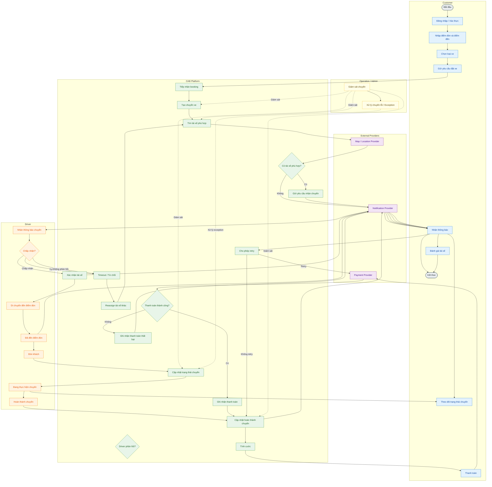
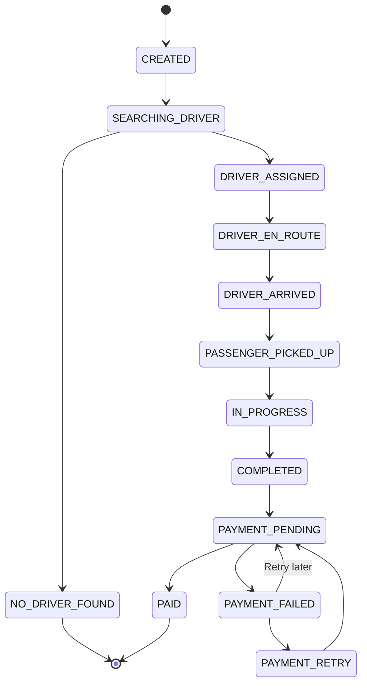

# SRS — CAB System (Nền tảng đặt xe)

---

## Bước 1 — Business Context & Business Problem 

### 1. Business Context

- ABC đang chuyển đổi từ mô hình đặt xe phụ thuộc vào tổng đài và phân công tài xế thủ công sang mô hình nền tảng CAB số hóa và tự động hóa. CAB đóng vai trò là hệ thống trung tâm kết nối khách hàng, tài xế và bộ phận vận hành, quản lý toàn bộ vòng đời chuyến xe từ đặt xe, tìm tài xế, thực hiện chuyến, tính cước, thanh toán, thông báo đến đánh giá. Hệ thống đồng thời tích hợp với các hệ thống bên ngoài như Payment Provider, Notification Provider và Map/Location Provider.

- Về mặt kinh doanh, CAB cần giúp ABC giảm thao tác thủ công, nâng cao tỷ lệ đáp ứng chuyến, cải thiện trải nghiệm khách hàng, tăng hiệu quả vận hành và tạo nền tảng có khả năng mở rộng cho các loại dịch vụ, phương thức thanh toán và kênh thông báo mới.

- Trong phạm vi hiện tại, các quy tắc về pricing, driver matching, timeout, cancellation, payment retry, location tracking và data retention chưa được chốt và cần được xác nhận trước khi hoàn thiện thiết kế chi tiết.

### 2. Business Problem

- ABC hiện đang gặp khó khăn trong việc vận hành và mở rộng dịch vụ đặt xe do quy trình booking và phân công tài xế còn phụ thuộc nhiều vào thao tác thủ công, trong khi khả năng theo dõi chuyến, quản lý thanh toán, thông báo và hỗ trợ vận hành chưa được tập trung trên một nền tảng thống nhất.

- Những hạn chế này làm tăng thời gian xử lý yêu cầu, tăng tải cho bộ phận vận hành, làm giảm khả năng cung cấp thông tin realtime cho khách hàng và gây khó khăn trong việc xử lý các trường hợp ngoại lệ. Đồng thời, kiến trúc hiện tại chưa đáp ứng tốt yêu cầu mở rộng số lượng khách hàng, tài xế và chuyến đi, cũng như việc bổ sung các loại dịch vụ, phương thức thanh toán và kênh thông báo mới.

- Do đó, ABC cần một nền tảng CAB có khả năng số hóa và tự động hóa toàn bộ vòng đời chuyến xe, đồng thời cung cấp khả năng quản lý tập trung, realtime visibility, integration với các hệ thống bên ngoài và kiến trúc đủ linh hoạt để đáp ứng nhu cầu phát triển dài hạn.

---

## Bước 2 — Stakeholder 

### 3. Stakeholder

**1. Business Stakeholders**
- Ban Giám đốc / Sponsor
- Finance / Accounting

**2. Operational Stakeholders**
- Operation Staff
- Customer Support
- Admin

**3. End Users**
- Customer
- Driver

**4. Technology Stakeholders**
- IT / Technical Team
- Security / Compliance

**5. External Stakeholders**
- Payment Provider
- Notification Provider
- Map / Location Provider
- Other External Service Providers

**Matrix Stakeholder tổng quan:**

# Power–Interest Matrix

| Nhóm Stakeholder | Power | Interest | Quadrant | Cách quản lý |
|---|---|---|---|---|
| Ban Giám đốc / Sponsor | Cao | Cao | **Manage closely** | Quản lý chặt chẽ |
| Operation Staff | Cao | Cao | **Manage closely** | Quản lý chặt chẽ |
| IT / Technical Team | Cao | Cao | **Manage closely** | Quản lý chặt chẽ |
| Security / Compliance | Cao | Cao | **Manage closely** | Quản lý chặt chẽ |
| Finance / Accounting | Cao | Thấp | **Keep satisfied** | Duy trì hài lòng |
| Admin | Thấp | Thấp | **Monitor** | Theo dõi |
| Customer | Thấp | Cao | **Keep informed** | Cập nhật thông tin |
| Driver | Thấp | Cao | **Keep informed** | Cập nhật thông tin |
| Customer Support | Thấp | Cao | **Keep informed** | Cập nhật thông tin |
| Payment Provider | Thấp | Thấp | **Monitor** | Theo dõi |
| Notification Provider | Thấp | Thấp | **Monitor** | Theo dõi |
| Map/Location Provider | Thấp | Thấp | **Monitor** | Theo dõi |
| Other External Providers | Thấp | Thấp | **Monitor** | Theo dõi |

## Ma trận

| | **Interest thấp** | **Interest cao** |
|---|---|---|
| **Power cao** | 🟡 **Keep satisfied** - Finance / Accounting | 🔴 **Manage closely** - Ban Giám đốc / Sponsor - Operation Staff - IT / Technical Team - Security / Compliance |
| **Power thấp** | 🟢 **Monitor** - Admin - Payment Provider - Notification Provider - Map/Location Provider - Other External Providers | 🔵 **Keep informed** - Customer - Driver - Customer Support |

### Chiến lược
- 🔴 **Manage closely:** Phối hợp thường xuyên, tham vấn và cập nhật liên tục.
- 🟡 **Keep satisfied:** Đảm bảo nhu cầu được đáp ứng, tránh để phát sinh vấn đề.
- 🔵 **Keep informed:** Cung cấp thông tin và cập nhật tiến độ phù hợp.
- 🟢 **Monitor:** Theo dõi ở mức cần thiết, không cần giao tiếp thường xuyên.

---

## Bước 3 — Business Goal 

### 4. Business Goal

| Mã | Business Goal | Mô tả |
|---|---|---|
| BG1 | Số hóa và tự động hóa vòng đời chuyến xe | Chuyển đổi toàn bộ quy trình đặt xe, tìm tài xế và phân công từ thao tác thủ công qua tổng đài sang quy trình tự động trên nền tảng số, giảm sự phụ thuộc vào con người trong các bước có thể tự động hóa (matching, thông báo, tính cước). |
| BG2 | Nâng cao tỷ lệ đáp ứng chuyến (fulfillment rate) | Tăng tỷ lệ chuyến được tìm thấy tài xế thành công và hoàn thành, thông qua cơ chế matching thông minh và xử lý timeout/reassign khi tài xế không phản hồi hoặc từ chối, hạn chế tình trạng khách hàng không tìm được xe. |
| BG3 | Cải thiện trải nghiệm khách hàng và tài xế | Cung cấp khả năng theo dõi realtime trạng thái chuyến đi (tìm tài xế, tài xế nhận chuyến, thời gian dự kiến đến, hoàn thành chuyến), lịch sử chuyến, thanh toán minh bạch và đánh giá sau chuyến, giúp tăng mức độ hài lòng và giữ chân người dùng. |
| BG4 | Tập trung hóa quản lý vận hành và dữ liệu | Xây dựng giao diện quản trị tập trung cho nhân viên vận hành để giám sát chuyến, tài xế, xử lý ngoại lệ và tra cứu lịch sử giao dịch, thay vì thông tin phân tán như hiện tại; đồng thời cung cấp báo cáo về số lượng chuyến, doanh thu, tỷ lệ hoàn thành/hủy và hiệu quả tài xế phục vụ ra quyết định. |
| BG5 | Đảm bảo khả năng mở rộng (scalability) và tính sẵn sàng cao (high availability) | Thiết kế kiến trúc cho phép các thành phần hệ thống (booking, payment, notification, tracking) mở rộng độc lập khi tải tăng, và đảm bảo lỗi ở một phân hệ (ví dụ payment hoặc notification) không làm gián đoạn toàn bộ hệ thống đặt xe. |
| BG6 | Tạo nền tảng linh hoạt cho phát triển dài hạn | Cho phép bổ sung trong tương lai các loại hình dịch vụ mới, phương thức thanh toán mới, nhà cung cấp thông báo mới hoặc thay đổi thành phần kỹ thuật mà không cần xây dựng lại toàn bộ hệ thống, thông qua kiến trúc tích hợp (Payment Provider, Notification Provider, Map/Location Provider) theo hướng module hóa. |
| BG7 | Đảm bảo an toàn và tuân thủ dữ liệu | Bảo vệ thông tin cá nhân, dữ liệu vị trí, dữ liệu giao dịch và thông tin thanh toán; kiểm soát quyền truy cập theo vai trò (role-based access) đối với các thao tác quản trị nhạy cảm; lưu vết (audit log) các thao tác quan trọng phục vụ điều tra sự cố. |

---

## Bước 4 — Project Scope 

### 5. Project Scope

#### 5.1 In-Scope (MVP)

**A. Customer**
- Đăng ký / đăng nhập tài khoản
- Cập nhật thông tin cá nhân cơ bản
- Nhập điểm đón, điểm đến, chọn loại xe
- Gửi yêu cầu đặt xe
- Theo dõi trạng thái chuyến (đang tìm tài xế / đã có tài xế / đang di chuyển / hoàn thành)
- Xem lịch sử chuyến và số tiền đã thanh toán
- Đánh giá tài xế sau chuyến (rating đơn giản)

**B. Driver**
- Đăng ký / được Operation tạo tài khoản
- Cập nhật hồ sơ, thông tin phương tiện
- Chuyển trạng thái sẵn sàng / không sẵn sàng nhận chuyến
- Nhận thông báo chuyến mới, chấp nhận / từ chối
- Cập nhật trạng thái chuyến: đã đến điểm đón, đã đón khách, đang di chuyển, hoàn thành

**C. Driver Matching**
- Tìm tài xế phù hợp dựa trên vị trí và trạng thái sẵn sàng (thuật toán matching cơ bản — chưa cần tối ưu nâng cao)
- Cơ chế timeout + reassign sang tài xế khác nếu không phản hồi/từ chối
- Thông báo cho khách hàng nếu không tìm được tài xế

**D. Pricing & Payment**
- Tính cước cơ bản dựa trên loại dịch vụ + thông tin chuyến (công thức đơn giản, chưa gồm surge/dynamic pricing)
- Thanh toán tiền mặt
- Tích hợp 1 Payment Provider cho thanh toán điện tử (không lưu thông tin thẻ trong hệ thống CAB)
- Thông báo khi giao dịch thất bại + cho phép retry cơ bản

**E. Notification**
- Thông báo cho khách hàng: yêu cầu được tiếp nhận, tài xế nhận chuyến, tài xế đến, hoàn thành chuyến, kết quả thanh toán
- Thông báo cho tài xế: chuyến mới, thay đổi chuyến đang thực hiện
- Tích hợp 1 kênh thông báo (ví dụ push notification hoặc SMS) — kiến trúc cho phép mở rộng thêm kênh sau

**F. Operation/Admin**
- Giao diện quản trị cơ bản: xem chuyến đang diễn ra, trạng thái tài xế
- Hỗ trợ xử lý chuyến lỗi (thủ công)
- Tra cứu lịch sử giao dịch
- Phân quyền cơ bản (Admin vs Operation Staff)

**G. Non-functional (mức tối thiểu cho MVP)**
- Xác thực người dùng (Customer, Driver, Admin)
- Kiểm soát truy cập cho thao tác quản trị nhạy cảm
- Log các thao tác quan trọng (audit log cơ bản)
- Kiến trúc cho phép các module (payment, notification) lỗi độc lập không kéo sập toàn hệ thống

#### 5.2 Out-of-Scope

- Báo cáo nâng cao (doanh thu, tỷ lệ hủy, hiệu quả tài xế theo thời gian, dashboard BI)
- Đa dạng phương thức thanh toán (ví điện tử, thẻ tín dụng lưu sẵn, thanh toán trả sau)
- Nhiều kênh thông báo đồng thời (email + SMS + push + in-app)
- Thuật toán matching nâng cao (machine learning, dự đoán nhu cầu, surge pricing)
- Đa loại hình dịch vụ (giao hàng, xe ghép, đặt trước theo lịch)
- Ứng dụng riêng cho Driver/Customer (MVP có thể dùng web responsive hoặc app tối giản)
- Tối ưu hóa location tracking nâng cao (dự đoán ETA chính xác cao, bản đồ realtime chi tiết)
- Chính sách hủy chuyến phức tạp, phí phạt hủy
- Tích hợp nhiều Payment/Notification/Map Provider song song (chỉ 1 provider mỗi loại cho MVP)

---

## Bước 5 — Business Requirement 

### 6. Business Requirement

> **Business Requirement** mô tả cái hệ thống cần làm được ở mức nghiệp vụ (chưa đi sâu vào chi tiết chức năng/màn hình như Functional Requirement), gắn với từng Business Goal và nằm trong phạm vi MVP đã chốt.

| Mã | Business Requirement | Liên kết Business Goal | Nhóm |
|---|---|---|---|
| BR-01 | Hệ thống phải cho phép khách hàng tự đăng ký, xác thực và tạo yêu cầu đặt xe mà không cần qua tổng đài | BG1, BG2 | Booking |
| BR-02 | Hệ thống phải tự động tìm và phân công tài xế phù hợp dựa trên vị trí và trạng thái sẵn sàng, không cần thao tác thủ công của Operation | BG1, BG2 | Matching |
| BR-03 | Hệ thống phải xử lý được trường hợp tài xế không phản hồi/từ chối bằng cách tự động chuyển sang tài xế khác, không yêu cầu khách hàng tạo lại yêu cầu | BG2 | Matching |
| BR-04 | Hệ thống phải cung cấp cho khách hàng khả năng theo dõi trạng thái chuyến đi theo thời gian thực | BG3 | Tracking |
| BR-05 | Hệ thống phải tự động tính cước dựa trên loại dịch vụ và thông tin chuyến sau khi hoàn thành | BG1, BG2 | Payment |
| BR-06 | Hệ thống phải hỗ trợ thanh toán tiền mặt và tích hợp với một nhà cung cấp thanh toán điện tử bên ngoài | BG3, BG6 | Payment |
| BR-07 | Hệ thống không được lưu trữ trực tiếp thông tin nhạy cảm về thẻ/tài khoản thanh toán của khách hàng | BG7 | Payment / Security |
| BR-08 | Hệ thống phải gửi thông báo tới khách hàng và tài xế tại các mốc quan trọng của chuyến đi (tiếp nhận, tài xế nhận chuyến, đến điểm đón, hoàn thành, kết quả thanh toán) | BG3 | Notification |
| BR-09 | Hệ thống phải cung cấp giao diện quản trị để Operation Staff giám sát chuyến đang diễn ra và xử lý các trường hợp ngoại lệ | BG4 | Operation |
| BR-10 | Hệ thống phải phân quyền truy cập, đảm bảo nhân viên thông thường không thể thực hiện các thao tác quản trị nhạy cảm | BG7 | Security |
| BR-11 | Hệ thống phải ghi log các thao tác quan trọng phục vụ tra soát khi có sự cố | BG7 | Security / Audit |
| BR-12 | Kiến trúc hệ thống phải cho phép các thành phần (booking, payment, notification) hoạt động và mở rộng độc lập, lỗi một thành phần không được làm gián đoạn toàn hệ thống | BG5 | Architecture |
| BR-13 | Kiến trúc hệ thống phải cho phép bổ sung provider mới (thanh toán, thông báo, bản đồ) trong tương lai mà không cần xây dựng lại toàn bộ hệ thống | BG6 | Architecture |

## Bước 6 - Business Process

## Bước 7 - Functional Requirement
Được. Dựa trên context hiện tại, phần **Functional Requirement (FR)** nên đi sâu hơn BR: mô tả **hệ thống phải thực hiện chức năng gì**, có actor, trigger, business rule và kết quả mong đợi.

Tôi đề xuất cấu trúc FR theo 9 nhóm: **Authentication, Customer, Booking, Matching, Trip/Tracking, Pricing & Payment, Notification, Operation/Admin, Rating & Audit**.

## 6. Functional Requirement

### 6.1 Authentication & Account Management

| Mã     | Functional Requirement                                                                               | Actor                   | Priority |
| ------ | ---------------------------------------------------------------------------------------------------- | ----------------------- | -------- |
| FR-001 | Hệ thống phải cho phép Customer đăng ký tài khoản bằng thông tin định danh được cấu hình cho MVP.    | Customer                | Must     |
| FR-002 | Hệ thống phải cho phép người dùng đăng nhập bằng thông tin xác thực hợp lệ.                          | Customer, Driver, Admin | Must     |
| FR-003 | Hệ thống phải xác thực thông tin đăng nhập trước khi cấp quyền truy cập các chức năng tương ứng.     | System                  | Must     |
| FR-004 | Hệ thống phải cho phép Customer cập nhật thông tin cá nhân cơ bản.                                   | Customer                | Must     |
| FR-005 | Hệ thống phải cho phép Driver cập nhật hồ sơ và thông tin phương tiện theo quyền được cấp.           | Driver, Operation       | Must     |
| FR-006 | Hệ thống phải phân biệt vai trò Customer, Driver, Operation Staff và Admin khi người dùng đăng nhập. | System                  | Must     |
| FR-007 | Hệ thống phải từ chối truy cập chức năng nếu người dùng không có quyền tương ứng.                    | System                  | Must     |

---

### 6.2 Customer & Booking

| Mã     | Functional Requirement                                                                     | Actor    | Priority |
| ------ | ------------------------------------------------------------------------------------------ | -------- | -------- |
| FR-008 | Hệ thống phải cho phép Customer nhập điểm đón và điểm đến.                                 | Customer | Must     |
| FR-009 | Hệ thống phải cho phép Customer lựa chọn loại xe/dịch vụ được hỗ trợ.                      | Customer | Must     |
| FR-010 | Hệ thống phải nhận yêu cầu đặt xe và tạo booking tương ứng.                                | Customer | Must     |
| FR-011 | Hệ thống phải kiểm tra các thông tin bắt buộc trước khi tạo booking.                       | System   | Must     |
| FR-012 | Hệ thống phải tạo mã định danh duy nhất cho mỗi booking/chuyến xe.                         | System   | Must     |
| FR-013 | Hệ thống phải ghi nhận thời gian tạo booking, Customer, điểm đón, điểm đến và loại xe.     | System   | Must     |
| FR-014 | Hệ thống phải xác nhận cho Customer rằng yêu cầu đặt xe đã được tiếp nhận.                 | System   | Must     |
| FR-015 | Hệ thống phải hiển thị trạng thái hiện tại của booking cho Customer.                       | Customer | Must     |
| FR-016 | Hệ thống phải ngăn Customer tạo các booking không hợp lệ theo business rule được cấu hình. | System   | Must     |

---

### 6.3 Driver Matching

| Mã     | Functional Requirement                                                                                                                           | Actor  | Priority |
| ------ | ------------------------------------------------------------------------------------------------------------------------------------------------ | ------ | -------- |
| FR-017 | Hệ thống phải xác định các Driver đang ở trạng thái sẵn sàng nhận chuyến.                                                                        | System | Must     |
| FR-018 | Hệ thống phải sử dụng vị trí hiện tại của Driver để xác định Driver phù hợp với booking.                                                         | System | Must     |
| FR-019 | Hệ thống phải gửi yêu cầu nhận chuyến tới Driver phù hợp.                                                                                        | System | Must     |
| FR-020 | Hệ thống phải ghi nhận phản hồi của Driver đối với yêu cầu nhận chuyến.                                                                          | System | Must     |
| FR-021 | Hệ thống phải xác định yêu cầu nhận chuyến đã timeout nếu Driver không phản hồi trong khoảng thời gian được cấu hình.                            | System | Must     |
| FR-022 | Khi Driver từ chối hoặc timeout, hệ thống phải thực hiện matching lại với Driver khác.                                                           | System | Must     |
| FR-023 | Hệ thống không được gửi cùng một booking tới Driver đã từ chối booking đó trong cùng vòng matching, trừ khi có business rule khác được cấu hình. | System | Must     |
| FR-024 | Hệ thống phải xác nhận Driver đầu tiên đáp ứng hợp lệ cho booking theo cơ chế locking/concurrency phù hợp.                                       | System | Must     |
| FR-025 | Hệ thống phải cập nhật booking sang trạng thái đã có Driver khi matching thành công.                                                             | System | Must     |
| FR-026 | Nếu không còn Driver phù hợp, hệ thống phải cập nhật booking sang trạng thái không tìm được Driver.                                              | System | Must     |
| FR-027 | Hệ thống phải thông báo cho Customer khi không tìm được Driver.                                                                                  | System | Must     |

> **Open point:** giá trị timeout, bán kính tìm Driver và tiêu chí “phù hợp” chưa được chốt trong Business Requirement và cần được xác nhận.

---

### 6.4 Trip Management & Tracking

| Mã     | Functional Requirement                                                                            | Actor    | Priority |
| ------ | ------------------------------------------------------------------------------------------------- | -------- | -------- |
| FR-028 | Hệ thống phải quản lý trạng thái vòng đời của chuyến xe.                                          | System   | Must     |
| FR-029 | Hệ thống phải cho phép Driver cập nhật trạng thái “Đã đến điểm đón”.                              | Driver   | Must     |
| FR-030 | Hệ thống phải cho phép Driver cập nhật trạng thái “Đã đón khách”.                                 | Driver   | Must     |
| FR-031 | Hệ thống phải cho phép Driver cập nhật trạng thái “Đang di chuyển”.                               | Driver   | Must     |
| FR-032 | Hệ thống phải cho phép Driver cập nhật trạng thái “Hoàn thành”.                                   | Driver   | Must     |
| FR-033 | Hệ thống phải kiểm tra tính hợp lệ của chuyển đổi trạng thái trước khi cập nhật.                  | System   | Must     |
| FR-034 | Hệ thống phải cập nhật trạng thái chuyến cho Customer khi trạng thái thay đổi.                    | System   | Must     |
| FR-035 | Hệ thống phải cung cấp cho Customer khả năng theo dõi trạng thái chuyến gần realtime.             | Customer | Must     |
| FR-036 | Hệ thống phải sử dụng Map/Location Provider để hỗ trợ thông tin vị trí phục vụ matching/tracking. | System   | Must     |
| FR-037 | Hệ thống phải ghi nhận các sự kiện trạng thái quan trọng của chuyến để phục vụ tra cứu.           | System   | Must     |

---

### 6.5 Pricing

| Mã     | Functional Requirement                                                     | Actor  | Priority |
| ------ | -------------------------------------------------------------------------- | ------ | -------- |
| FR-038 | Hệ thống phải xác định mức cước dựa trên loại dịch vụ và thông tin chuyến. | System | Must     |
| FR-039 | Hệ thống phải tính cước cuối chuyến khi Driver hoàn thành chuyến.          | System | Must     |
| FR-040 | Hệ thống phải lưu lại số tiền cước cuối cùng của chuyến.                   | System | Must     |
| FR-041 | Hệ thống phải cung cấp số tiền cần thanh toán cho Customer.                | System | Must     |
| FR-042 | Hệ thống không được áp dụng surge/dynamic pricing trong MVP.               | System | Must     |

> **Open point:** công thức pricing cụ thể chưa được chốt, do đó FR-038 cần được bổ sung rule chi tiết sau khi Business xác nhận.

---

### 6.6 Payment

| Mã     | Functional Requirement                                                                                      | Actor    | Priority |
| ------ | ----------------------------------------------------------------------------------------------------------- | -------- | -------- |
| FR-043 | Hệ thống phải cho phép Customer lựa chọn thanh toán tiền mặt hoặc thanh toán điện tử.                       | Customer | Must     |
| FR-044 | Đối với thanh toán điện tử, hệ thống phải gửi yêu cầu thanh toán tới Payment Provider.                      | System   | Must     |
| FR-045 | Hệ thống phải nhận và xử lý kết quả giao dịch từ Payment Provider.                                          | System   | Must     |
| FR-046 | Hệ thống phải cập nhật trạng thái giao dịch thành công khi Payment Provider xác nhận thanh toán thành công. | System   | Must     |
| FR-047 | Hệ thống phải ghi nhận giao dịch thất bại khi Payment Provider trả về kết quả thất bại.                     | System   | Must     |
| FR-048 | Hệ thống phải thông báo cho Customer khi thanh toán điện tử thất bại.                                       | System   | Must     |
| FR-049 | Hệ thống phải cho phép Customer thực hiện retry thanh toán theo cơ chế được cấu hình.                       | Customer | Must     |
| FR-050 | Hệ thống phải đảm bảo việc retry không tạo ra giao dịch thanh toán trùng cho cùng một nghĩa vụ thanh toán.  | System   | Must     |
| FR-051 | Hệ thống không được lưu trực tiếp thông tin thẻ hoặc thông tin thanh toán nhạy cảm của Customer.            | System   | Must     |
| FR-052 | Hệ thống phải lưu thông tin tham chiếu giao dịch cần thiết để tra cứu và đối soát.                          | System   | Must     |
| FR-053 | Hệ thống phải hiển thị lịch sử thanh toán của Customer.                                                     | Customer | Must     |

---

### 6.7 Notification

| Mã     | Functional Requirement                                                                             | Actor  | Priority |
| ------ | -------------------------------------------------------------------------------------------------- | ------ | -------- |
| FR-054 | Hệ thống phải gửi thông báo khi booking được tiếp nhận.                                            | System | Must     |
| FR-055 | Hệ thống phải gửi thông báo khi Driver nhận chuyến.                                                | System | Must     |
| FR-056 | Hệ thống phải gửi thông báo khi Driver đến điểm đón.                                               | System | Must     |
| FR-057 | Hệ thống phải gửi thông báo khi chuyến hoàn thành.                                                 | System | Must     |
| FR-058 | Hệ thống phải gửi thông báo kết quả thanh toán cho Customer.                                       | System | Must     |
| FR-059 | Hệ thống phải gửi thông báo chuyến mới cho Driver phù hợp.                                         | System | Must     |
| FR-060 | Hệ thống phải ghi nhận trạng thái gửi thông báo để phục vụ monitoring và troubleshooting.          | System | Should   |
| FR-061 | Hệ thống phải tách logic nghiệp vụ khỏi Notification Provider thông qua một abstraction/interface. | System | Must     |
| FR-062 | Hệ thống phải cho phép thay thế hoặc bổ sung Notification Provider trong tương lai.                | System | Should   |

---

### 6.8 Driver Management

| Mã     | Functional Requirement                                                                            | Actor     | Priority |
| ------ | ------------------------------------------------------------------------------------------------- | --------- | -------- |
| FR-063 | Hệ thống phải cho phép Driver chuyển trạng thái sẵn sàng nhận chuyến.                             | Driver    | Must     |
| FR-064 | Hệ thống phải cho phép Driver chuyển trạng thái không sẵn sàng nhận chuyến.                       | Driver    | Must     |
| FR-065 | Hệ thống chỉ được đưa Driver đang sẵn sàng vào danh sách matching.                                | System    | Must     |
| FR-066 | Hệ thống phải lưu trạng thái hiện tại của Driver.                                                 | System    | Must     |
| FR-067 | Hệ thống phải hiển thị danh sách và trạng thái Driver cho Operation Staff.                        | Operation | Must     |
| FR-068 | Hệ thống phải cập nhật trạng thái Driver phù hợp sau khi Driver nhận/thực hiện/hoàn thành chuyến. | System    | Must     |

---

### 6.9 Operation & Admin

| Mã     | Functional Requirement                                                                             | Actor     | Priority |
| ------ | -------------------------------------------------------------------------------------------------- | --------- | -------- |
| FR-069 | Hệ thống phải cung cấp màn hình để Operation Staff xem các chuyến đang diễn ra.                    | Operation | Must     |
| FR-070 | Hệ thống phải hiển thị trạng thái hiện tại của từng chuyến.                                        | Operation | Must     |
| FR-071 | Hệ thống phải hiển thị Driver đang được phân công cho chuyến.                                      | Operation | Must     |
| FR-072 | Hệ thống phải cung cấp khả năng tra cứu lịch sử chuyến.                                            | Operation | Must     |
| FR-073 | Hệ thống phải cung cấp khả năng tra cứu lịch sử giao dịch.                                         | Operation | Must     |
| FR-074 | Hệ thống phải cho phép Operation Staff xử lý các trường hợp chuyến lỗi theo quyền được cấp.        | Operation | Must     |
| FR-075 | Hệ thống phải yêu cầu xác nhận trước các thao tác quản trị có khả năng thay đổi trạng thái chuyến. | System    | Should   |
| FR-076 | Hệ thống phải phân biệt quyền của Admin và Operation Staff.                                        | System    | Must     |
| FR-077 | Hệ thống phải hạn chế các thao tác quản trị nhạy cảm đối với Operation Staff không có quyền.       | System    | Must     |

---

### 6.10 Rating

| Mã     | Functional Requirement                                                     | Actor    | Priority |
| ------ | -------------------------------------------------------------------------- | -------- | -------- |
| FR-078 | Hệ thống phải cho phép Customer đánh giá Driver sau khi chuyến hoàn thành. | Customer | Must     |
| FR-079 | Hệ thống phải cho phép Customer gửi rating theo thang điểm được cấu hình.  | Customer | Must     |
| FR-080 | Hệ thống phải lưu rating gắn với chuyến và Driver tương ứng.               | System   | Must     |
| FR-081 | Hệ thống không được cho phép Customer đánh giá cùng một chuyến nhiều lần.  | System   | Must     |

---

### 6.11 History & Audit

| Mã     | Functional Requirement                                                                                  | Actor    | Priority |
| ------ | ------------------------------------------------------------------------------------------------------- | -------- | -------- |
| FR-082 | Hệ thống phải lưu lịch sử chuyến của Customer.                                                          | System   | Must     |
| FR-083 | Hệ thống phải cho phép Customer xem lịch sử chuyến của chính mình.                                      | Customer | Must     |
| FR-084 | Hệ thống phải lưu các sự kiện quan trọng trong vòng đời chuyến.                                         | System   | Must     |
| FR-085 | Hệ thống phải ghi audit log đối với các thao tác quản trị quan trọng.                                   | System   | Must     |
| FR-086 | Audit log phải chứa tối thiểu thông tin người thực hiện, thời gian, hành động và đối tượng bị tác động. | System   | Must     |
| FR-087 | Hệ thống phải hạn chế quyền truy cập audit log theo role/permission.                                    | System   | Must     |

---

## 6.12 Business Status Model

Để các Functional Requirement không bị mâu thuẫn với nhau, nên chuẩn hóa lifecycle của Booking/Trip:

### 6.13 Traceability giữa BR và FR

| Business Requirement | Functional Requirements                                          |
| -------------------- | ---------------------------------------------------------------- |
| BR-01                | FR-001 → FR-016                                                  |
| BR-02                | FR-017 → FR-020, FR-024 → FR-026                                 |
| BR-03                | FR-021 → FR-023                                                  |
| BR-04                | FR-028 → FR-037                                                  |
| BR-05                | FR-038 → FR-042                                                  |
| BR-06                | FR-043 → FR-049                                                  |
| BR-07                | FR-050 → FR-052                                                  |
| BR-08                | FR-054 → FR-062                                                  |
| BR-09                | FR-069 → FR-075                                                  |
| BR-10                | FR-006, FR-007, FR-076, FR-077                                   |
| BR-11                | FR-084 → FR-087                                                  |
| BR-12                | FR-061, FR-062 và các yêu cầu kiến trúc/NFR liên quan            |
| BR-13                | FR-061, FR-062 và abstraction tương ứng cho Payment/Map Provider |

### Một số điểm cần Business chốt trước khi khóa FR

1. **Authentication:** đăng ký bằng email, phone hay phương thức nào?
2. **Matching:** bán kính tìm Driver, thứ tự ưu tiên và số vòng reassign.
3. **Timeout:** Driver có bao nhiêu giây để accept/reject?
4. **Cancellation:** MVP đang out-of-scope policy phức tạp, nhưng có cần basic cancellation không?
5. **Pricing:** công thức tính cước chính xác.
6. **Payment:** retry tối đa bao nhiêu lần và trạng thái cuối nếu thất bại.
7. **Tracking:** tần suất cập nhật location và mức độ realtime.
8. **Notification:** MVP chọn Push hay SMS.
9. **Data retention:** thời gian lưu trip, payment và audit log.
10. **Admin override:** Operation được phép thay đổi những trạng thái nào và cần approval hay không.

**Khuyến nghị:** phần FR trên nên được xem là **baseline v1**, chưa nên đánh số lại/xóa các FR khi Business chưa trả lời các open points. Sau khi chốt, chúng ta có thể chuyển tiếp sang **Use Case Specification + User Story + Acceptance Criteria**, đồng thời tạo **FR → Use Case traceability matrix** để hoàn thiện SRS.
